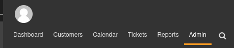
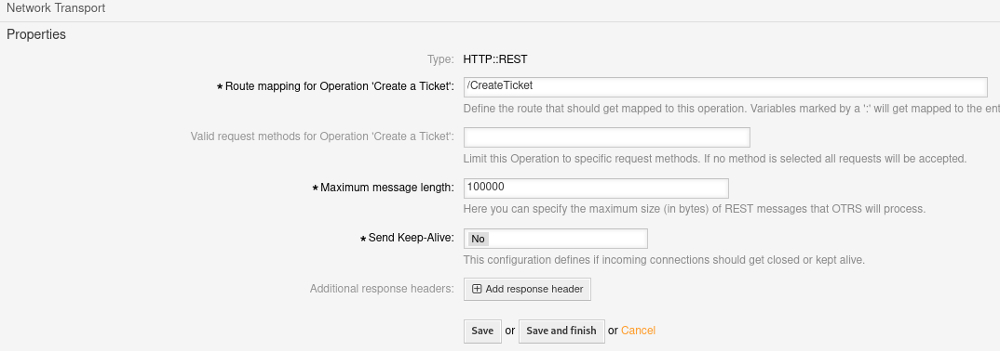
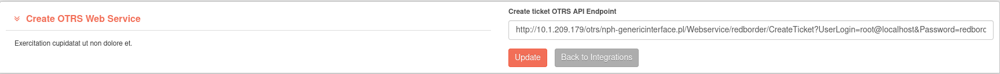

# OTRS

## Integrate OTRS with redBorder manager Web Platform

This documentation provides a step-by-step guide to integrating [OTRS](https://otrs.com/) with the redBorder Web Platform. By following these instructions, you will be able to create a [Web Service](https://academy.otrs.com/doc/admin/processes-automation/web-services/) in OTRS, allowing you to perform POST requests to create tickets.

This documentation is based on OTRS Community Edition 6.0.40 version.

## API Endpoint Example

Here is an example of the API endpoint you will create:

```http title="Create Ticket API Endpoint"
http://<virtual-machine-ip>/otrs/nph-genericinterface.pl/Webservice/redborder/CreateTicket?UserLogin=root@localhost&Password=redborder
```

### Parameters

- `<url>`: The base URL of your OTRS instance. For example, `http://<virtual-machine-ip>` in a development environment, or `https://example.com` in a production environment.
- `UserLogin`: The username of the user who will make the request. In this example, it is `root@localhost`.
- `Password`: The password for the user specified in `UserLogin`.

### Configurable Parameters

- `<web-service>`: The name of the web service you create, such as `redborder`.
- `<route-mapping>`: The route mapping for the request, which will be for ticket creation.

The general structure of the API endpoint with parameters is as follows:

```http title="Create Ticket API Endpoint seen with parameters"
<url>/otrs/nph-genericinterface.pl/Webservice/<web-service>/<route-mapping>?UserLogin=<username>&Password=<password>
```

## Steps to Create OTRS Web Service

Follow these steps to create a web service in OTRS:

!!! note

    Keep in mind that you have to need an Admin role to configure a Web Service.

### Log in as an `admin` user and go to the Admin Panel.

- Log in to your OTRS web portal with an admin account.
- Navigate to the **Admin** Panel.



### Access Web Services

- Scroll down to the **Web Services** card and **click** it.


### Add New Web Service

- Click the **"Add Web Service"** button.


### Name the Web Service

- In the General panel, enter the name of the web service, such as `redborder`.


### Configure Ticket Creation Operation

- Add the `Ticket::TicketCreate` operation in the **"OTRS as provider"** section.


### Set Operation Details

- **Name** the operation, for example, `Create a Ticket`.


### Configure Network Transport

- Set `HTTP::REST` as the Network Transport and click **"Configure"**.


### Define Route Mapping

- Set the **Route Mapping for Operation** to `/CreateTicket`, **Maximum message length** to `100000` and **Send Keep-Alive** to `No`.



### Save the Web Service

- Click **"Save and finish"** to finalize and generate the web service.


## Configure redBorder Web UI to Use the OTRS API

1. Go to `Tools -> Integrations`.
2. Click to the  **"OTRS API Integration"** card ("Get started" button).
3. Enter the **Create ticket OTRS API Endpoint**.
4. Press **"Update"** button to apply the changes.



```http title="Example of the created created endpoint"
http://<otrs-web-page>/otrs/nph-genericinterface.pl/Webservice/redborder/CreateTicket?UserLogin=root@localhost&Password=redborder
```
