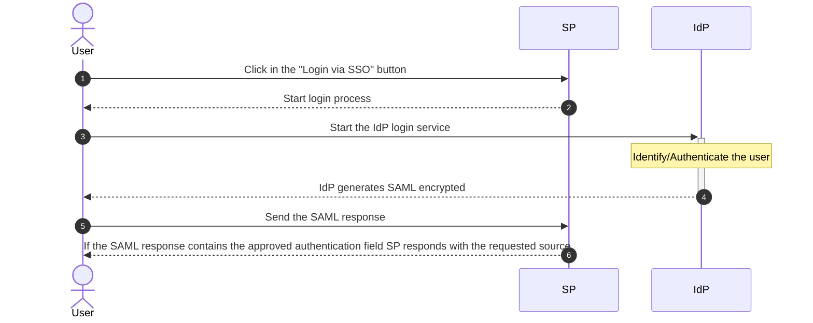
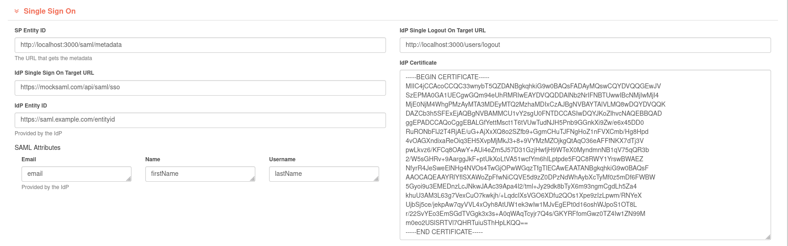

# Integrate Single Sign On with redBorder manager Web Platform  

This documentation provides a step-by-step guide to integrating [Single Sign On](https://en.wikipedia.org/wiki/Single_sign-on) (SSO) using the [SAML protocol](https://en.wikipedia.org/wiki/SAML_2.0) with the redBorder Web Platform. By following these instructions, you will be able to enable SSO and configure it, allowing you to login and register into the redBorder Web Platform.  

SAML Protocol diagram:  

## Enable SSO

First of all, you need to enable the SSO login system. For that go to `General Settings -> Single Sign On` and enable the related checkbox.  

After, the SSO login system is enabled. You can check it by going to the login page and seeing there is a button *"Login via SSO"* like the below image.  

  

## Configure redBorder Web UI to use SSO  

1. Go to `General Settings`.  
2. Click on the  **"Single Sign On"** card.  
3. Fill the fields with the related values.  
4. Press the **"Update"** button to apply the changes.  

### Configurable parameters

=== "IdP Parameters"  
    - **IdP Single Sign On Target URL**: This is the URL that redirects to the IdP when you want to login.  
    - **IdP Single Logout On Target URL**: This is the URL that redirects to the IdP when you want to log out. There are some IdPs that have not this configuration, then write the redBorder logout path: `<host>/users/logout`.  
    - **IdP Entity ID**: This is the URL used by the SP to verify the SAML responses coming from the IdP.  
    - **IdP Certificate**: The unique certificate provided by the IdP that allows decrypting the encrypted response of the authentication and get the user attributes.  
    - **IdP Attributes**: These are the attribute names of the IdP response. It contains the necessary data for the login/register. There are a lot of schemes (see the most common [here](https://wiki.surfnet.nl/display/surfconextdev/Attributes+and+SAML#AttributesandSAML-Attributeschemas)).  
        - Email: The user email.  
        - Name: The user name.  
        - Username: The id that will be registered or used to login.  

=== "SP Parameters"  
    - **SP Entity ID**: This is the URL of the SP that will receive the metadata from the IdP.  

## Login and register  

After setting all the settings, SSO can be used. To use it, go to the login path and you will see a button referring to SSO. Click on it and will redirect you to the SSO configured service of the IdP.  

!!! Warning  
    If it is the first time that an account logs into redBorder, you will need to enter the credentials twice: the first time for registering and then to logging in.  
