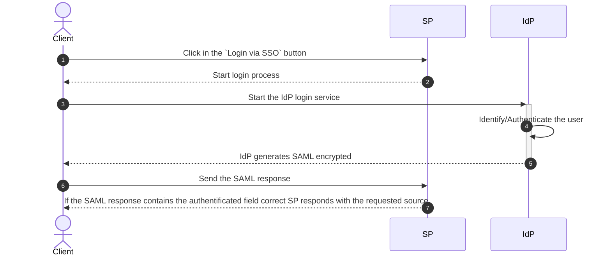

# Integrate SSO with redBorder manager Web Platform

This documentation provides a step-by-step guide to integrating [SSO](https://en.wikipedia.org/wiki/Single_sign-on) using the [SAML protocol](https://en.wikipedia.org/wiki/SAML_2.0) with the redBorder Web Platform. By following these instructions, you will be able to enable SSO and configure it, allowing you to login and register into the redBorder Web Plataform.  

SAML Protocol diagram:  



## Enable SSO

First, of all, you need to enable the SSO login system. For that go to the next file and check if there is a line like this:  

```title="root/rails/config/redborder_config.yml"
authentication_mode: saml
```

!!! note

    If instead of `saml` is written `database`, modify it and restart the service.  


After, the SSO login system es enabled. You can check it going to the login path and seeing there is a button *"Log ing via SSO"* like the below image.  

  

## Configure redBorder Web UI to use SSO

1. Go to `Tools -> Integrations`.
2. Click to the  **"Single Sign On"** card.
3. Fill the fields with the related values.
4. Press **"Update"** button to apply the changes.

### Configurable parameters


=== "IdP Parameters"
    - **IdP SSO Target URL**: This is the URL that redirects to the IdP when you want to login.
    - **IdP SLO Target URL**: This is the URL that redirects to the IdP when you want to logout. There are some IdPs that have not this configuration, then write the redBorder logout path: `<host>/logout`
    - **IdP Certificate**: The unique certificate provided by the IdP that allows to decrypt the encrypted response of the authentification and get the user attributes.
    - **IdP Attributes**: This are the attribute name of the IdP response. It contains the necessary data for the login/register. There are a lot of schemes ([see the most common here](https://wiki.surfnet.nl/display/surfconextdev/Attributes+and+SAML#AttributesandSAML-Attributeschemas))
        - Email: The user email.
        - Name: The user name.
        - Username: The id that will be registered or used to login.


=== "SP Parameters"
    - **SP Entity ID**: 


