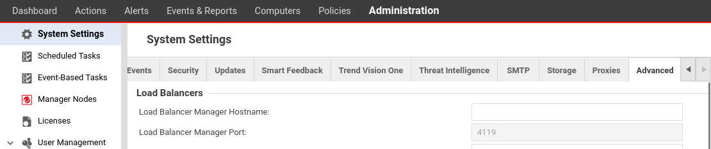
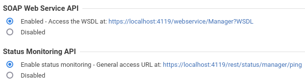
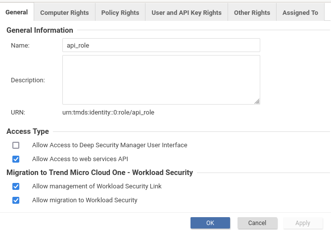

# Trend Micro

## Integrar Trend Micro con la Plataforma Web de redBorder Manager

Esta documentación proporciona una guía paso a paso para integrar [Trend Micro Deep Security Manager](https://www.trendmicro.com/es_es/business/products/hybrid-cloud/deep-security.html?utm_content=ent_cloud+security_lg_e_es_wg_ao_search&ent_cloud+one_lg_e_es_wg_ao_search&gad_source=1&gclid=Cj0KCQjwkdO0BhDxARIsANkNcrel8Dzy3FK5eq43xqTjoUjEzbPHWa83z9Di5gBm_DLFxWQUQGkY3g8aAjV-EALw_wcB) con la Plataforma Web de redBorder. Siguiendo estas instrucciones, podrá habilitar la [API de Servicios Web ](https://automation.deepsecurity.trendmicro.com/article/20_0/api-reference/) en Deep Security Manager, permitiéndole realizar solicitudes REST.

## Habilitar la API de Servicios Web

Primero, habilite la API de Servicios Web para Deep Security Manager. Puede consultar la [Documentación del Centro de Ayuda de Deep Security](https://help.deepsecurity.trendmicro.com/20_0/on-premise/welcome.html) para obtener más detalles.

1.- Navegue a *Administration -> System Settings* y seleccione la pestaña `Advanced`.



2.- Seleccione `Enabled` bajo **SOAP Web service API**, luego haga clic en `Save`. (Opcional: Seleccione Status Monitoring API)



## Crear un rol de Servicio Web (Opcional)

A continuación, cree un rol específico para realizar solicitudes REST. Este rol se utilizará al crear una clave API y debe especificarse para el rol de la clave API. Puede configurar los permisos de acceso para este rol, como Alertas, Listas de IP o horarios.

!!! note

    Puede personalizar la configuración del rol según sus necesidades.

1.- Navegue a *Administration -> User Management -> Roles* y haga clic en `New` para crear un rol.


2.- Desmarque la casilla `Allow Access to Deep Security Manager User Interface` y seleccione la casilla `Allow Access to web services API`.



3.- Configure otros ajustes según sea necesario, como Derechos de Computadora o Políticas, luego haga clic en `Apply` y `OK`.

## Crear una Clave API

1.- Navegue a *Administration -> User Management -> API Keys* y haga clic en el botón `New`.


2.- Establezca un nombre y un rol para la clave API, luego haga clic en el botón `Next`.


3.- Copie y guarde la clave API creada.


!!! warning

    Guarde la clave API cuidadosamente. Si la pierde, no podrá recuperarla.

## Configurar la Interfaz Web de redBorder para Usar la API de Trend Micro

1. Vaya a `Herramientas -> Integraciones`.
2. Haga clic en la tarjeta **"Integración con la API de Deep Security Manager (Trend Micro)"** (botón "Empezar").
3. Complete el formulario.
4. Presione el botón **"Actualizar"** para aplicar los cambios.


```http title="Ejemplo de Deep Security Manager URL"
https://dsm.example.com:4119
```