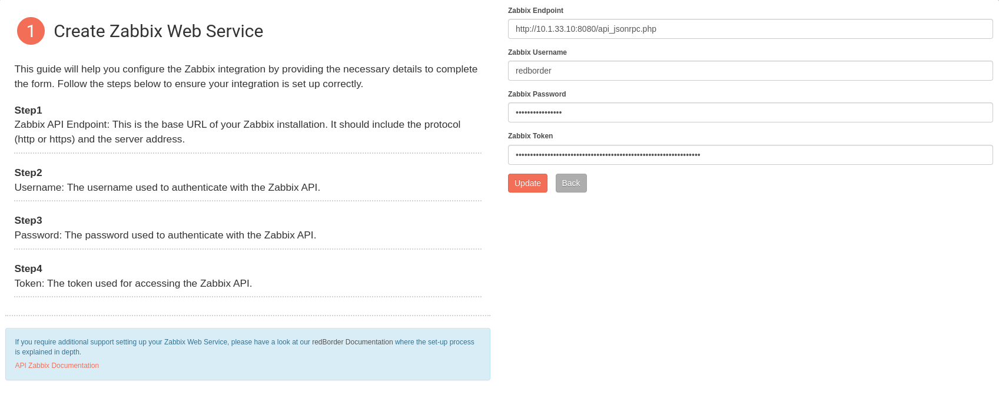

# Zabbix Integration Guide

## Introduction

This documentation provides a step-by-step guide to integrating [Zabbix](https://www.zabbix.com/manuals) with the redBorder Web Platform. By following these instructions, you will be able to make POST requests to the Zabbix API to create and manage items within Zabbix from the redBorder platform. Zabbix will enrich the assets information by adding additional data.

!!! note "Integration Version" 
    This integration works with Zabbix version 6.4.14.

## API Endpoint Example

Here is an example of the API endpoint for the integration:

    http://<zabbix-server-ip>/zabbix/api_jsonrpc.php

### Parameters

To integrate Zabbix, this parameters are required to know for the configuration:

| Parameter          | Description                                      |
| ------------------ | ------------------------------------------------ |
| Zabbix Endpoint    | The Endpoint address of your Zabbix instance.    |
| Zabbix Username    | The username for accessing the Zabbix API.       |
| Zabbix Password    | The password for the specified username.         |
| Zabbix Token       | Token used to access the Zabbix API.             |

!!! info "Note"
    The `Zabbix Username` and `Zabbix Password` are the credentials used to log in to the Zabbix web interface.

!!! warning "Important"
    Ensure that the user has appropriate permissions and has also created a `Zabbix Token` with the necessary permissions to access the Zabbix API. (Search how to generate API token in official Zabbix documentation).

## Configuring redBorder Web UI to Use the Zabbix API

To configure Zabbix in Redborder Web, follow these steps:

1. Navigate to `Tools -> Integrations`.
2. Click on the card titled **"Zabbix API Integration"** (click the "Start" button).
3. Fill in all required fields.
4. Click the **"Update"** button to apply the changes.

## Asset Enrichment

To enrich assets with data from Zabbix, follow these steps:

1. Once the Zabbix parameters are entered, go to the section `Tools -> Worker & Job Queue`.
2. A new task, **"Zabbix Inventory"**, will now be available. This task will only be visible if the Zabbix parameters are set.
3. When executing this task, the values of the IP/MAC addresses in the objects will be modified according to the information from Zabbix. That is, if an IP/MAC value has a different name or object type, it will be updated based on the information from Zabbix.
