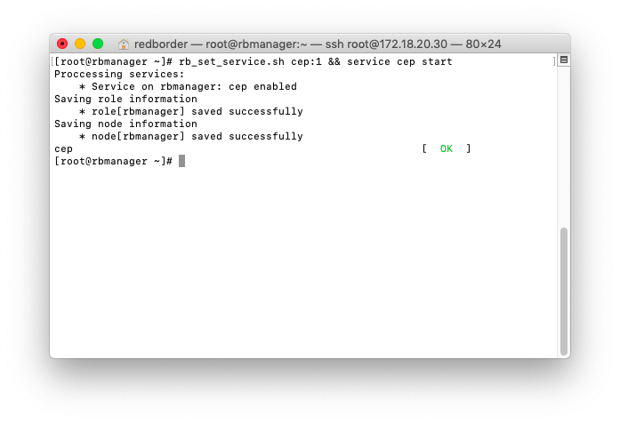
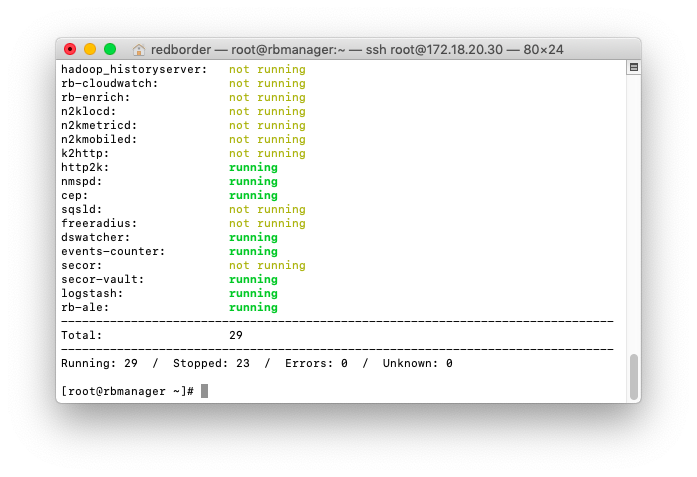

# Ataques de fuerza bruta SSH

En este caso, queremos proteger y monitorear un servidor SSH crítico, por lo que utilizaremos reglas Siddhi para rastrear cualquier tipo de ataque de fuerza bruta.

Una vez que tenemos configurado el servidor SSH y ya hemos creado un sensor para él en Redborder, necesitamos habilitar el motor de correlación.

Para habilitar el motor de correlación, debemos introducir los siguientes comandos en la terminal del administrador.

Después de eso tendremos que esperar unos minutos para asegurarnos de que CEP se esté ejecutando. Podemos usar el comando `rbcli service list` para asegurarnos de ello.

Después de eso, ahora podemos ir a las Reglas del motor de correlación desde el menú Herramientas.

Usaremos la regla Siddhi de fuerza bruta SSH.

Podemos ver la regla haciendo clic en el botón de edición a la derecha.

Vamos a cambiar el número máximo de intentos a 3.

Después de eso, debemos marcar la casilla de habilitación de la regla y aplicar todos los cambios.

En el módulo Vault veremos el sensor CEP.

Podemos filtrar por sensor CEP para ver los mensajes.

En la pestaña de mensajes podemos ver los mensajes del sensor CEP, que muestra que está alertando de que se está realizando un ataque de fuerza bruta.

> **Nota:** El motor de correlación tiene un gran potencial debido a las reglas Siddhi. Las reglas predeterminadas incluidas en el administrador se pueden editar para adaptarlas a sus propósitos o crear otras nuevas.
