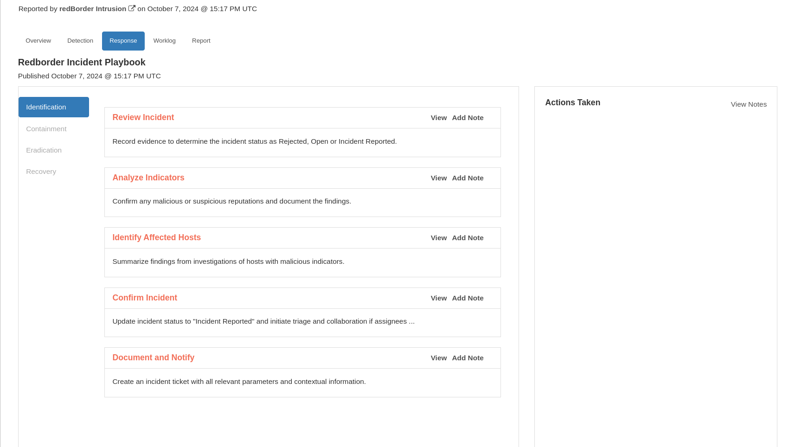
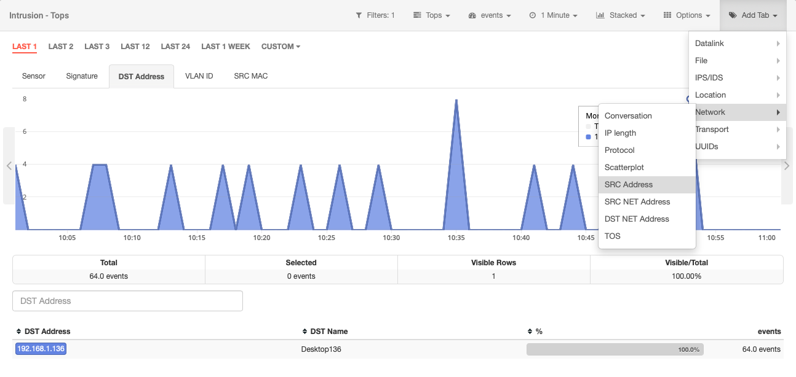
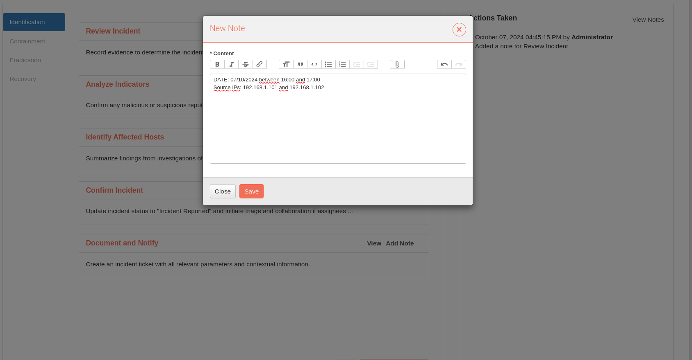

# Detección de un ataque Eternalblue con Redborder

En este caso, veremos cómo gestionar un incidente de ataque *Eternalblue*.

!!! info "Tenga en cuenta..."
    Este caso está basado en un incidente real, pero las capturas tomadas corresponden enteramente a una simulación.

## Contexto

Todo comienza con un correo electrónico de phishing malicioso que contiene un *dropper* que instala un *ransomware*.

El *ransomware* intentará utilizar un *exploit* conocido para tomar el control de todas las máquinas posibles.

Ataque Eternalblue: escenario

## Gestión de Incidentes

En la vista de incidentes, ha aparecido un nuevo incidente que necesita ser investigado. En este caso, tú eres el encargado de hacerlo.

*Lista de Incidentes*

Al hacer clic en el incidente se mostrarán los detalles del mismo. Comenzando por la visión general, puedes ver que el incidente está afectando a *algunas* máquinas.

*Resumen del Incidente*

A partir de aquí, se puede deducir que el ataque es importante porque puede estar afectando a muchas máquinas.

## Iniciar la investigación

Puedes decidir iniciar la investigación manteniendo el incidente abierto. Sin embargo, en otras situaciones, puedes decidir rechazar el incidente porque es un falso positivo o trasladar la tarea a otra persona como informar del incidente. Hagas lo que hagas, añade la nota correspondiente en el **playbook**, en la sección **Respuesta**.

*Respuesta al incidente*

*Primeras notas*

Las notas pueden ampliarse en función de la información que tengas, como módulos extra, acceso a la máquina física o fuentes externas. Pero el lugar más interesante para revisar es la fuente de datos correspondiente, que en este caso es **redBorder Intrusion**. Al hacer clic en ella, te redirigirá a la vista correspondiente.

## Entrando en la fuente

Redborder puede utilizar reglas Snort para detectar la respuesta de eco del protocolo *SMBv1* utilizada por el *ransomware*, por lo que podemos utilizar el módulo de intrusión para ver las firmas que identifican el ataque.

Ataque Eternalblue: Intrusión

Aquí podemos ver las firmas actuales recopiladas por Redborder.

Ataque Eternalblue: filtrando firma

Una vez que hemos filtrado la firma de *Eternalblue*, podemos mostrar la métrica de Dirección SRC para rastrear las IPs involucradas en el ataque.

Ataque Eternalblue: seleccionando métrica de Dirección SRC

Ahora tenemos las IPs de las máquinas involucradas, por lo que es posible tomar acciones para resolver el agujero de seguridad.

Ataque Eternalblue: IPs involucradas en el ataque

!!! info "Ten en cuenta..."
  
    Es importante tener una versión actualizada de las reglas Snort para detectar comportamientos y tráfico extraños con Redborder.

## Volver al informe

Volviendo a la vista de respuesta al incidente, debes añadir las notas sobre la investigación. En este caso, puedes informar de las IPs de origen descubiertas.

*Añadiendo notas de hosts afectados*

E informar que el siguiente usuario necesita revisar esos hosts para iniciar la siguiente fase del incidente.

*Confirmar notas del incidente*

## ¿Qué sigue?

Se espera que el usuario informado recoja el incidente en este estado e inicie la fase de contención del malware, empezando por aislar las máquinas afectadas.
