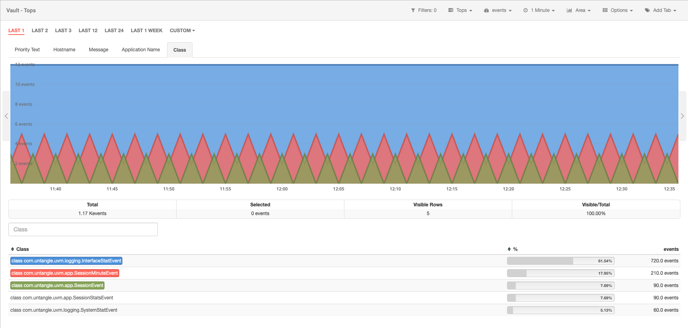
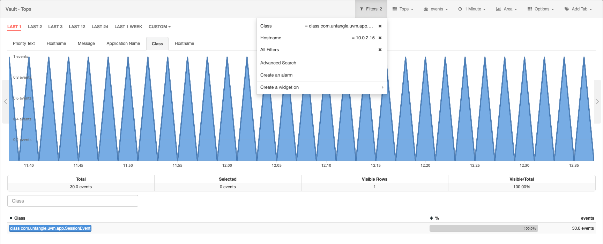

# Reviewing remote information from Untangle

Redborder has the capability to collect information from other manufacturers and use it to monitorize remote systems. In this use case we will show how is possible to review a remote system status which is being monitorized by *Untangle*.

First of all we will access to **Vault** module.

Módulo Vault: vista del nombre de protocolo

We will select the **Class** metric from *Untangle* and will filter one of them.

Vault module: Untangle class metric

Once we have filtered the class, we will see the hostname metric which are using the filtered class.

Vault module: hostname view

We want to know which protocol is being used by the hostname and the class filtered.

Vault module: filter view

Using the filter tool we can see that the protocol used by that particular hostname and that particular class is **UDP**.

Vault module: protocol name view
