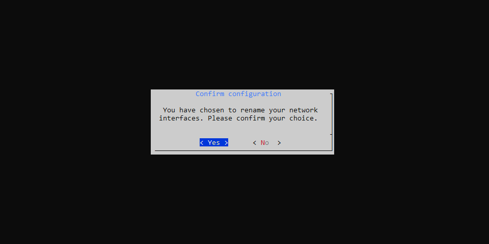
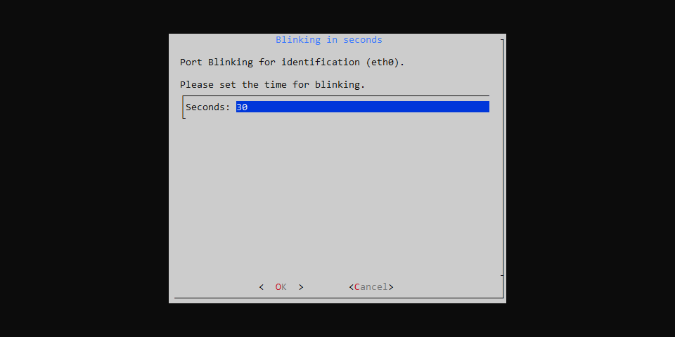
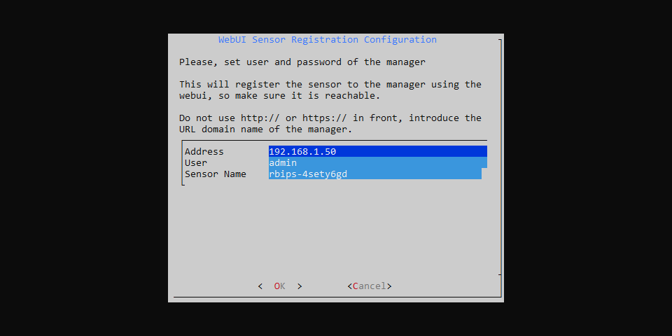
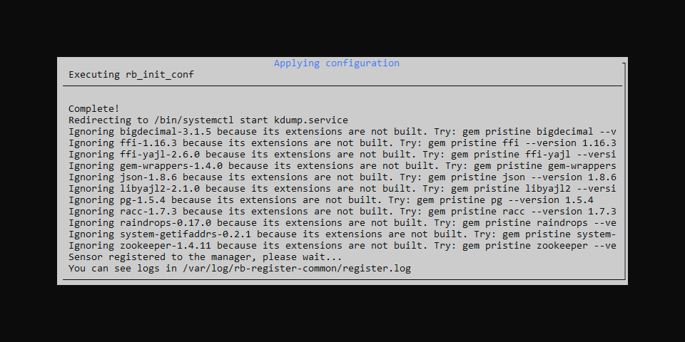

# Installation on Linux

How to install Redborder Intrusion on Linux systems.

Important things to know before installing:

- This installation is non-reversible, cannot be directly uninstalled or rolled back.
- The linux distribution supported at the moment is [Rocky Linux 9 minimal](https://rockylinux.org/download).
- This sensor must be registered with a **Redborder Manager**, so ensure you have one available.

## Prerequisites

### Virtual machine or baremetal

The requirements may vary depending on the volume of traffic to analyze. The following are the minimum requirements:

| **Component**      | **Specification**                                     |
|--------------------|-------------------------------------------------------|
| **Operating System** | Rocky Linux 9 minimal                               |
| **Memory**         | 8 GB RAM                                              |
| **Storage**        | 40 GB HDD space                                       |
| **CPU**            | at least 4 CPU Cores or 4 vCPU                        |
| **Network Interfaces**  | at least 2 (management interface + an interface for single-port network segment)     |

## Packages Installation

Install the supported operative system and run the following command as root:

``` bash title="Repositories installation"
yum install epel-release
rpm -ivh https://repo.redborder.com/ng/24.11/rhel/9/x86_64/redborder-repo-24.11-0.0.1-1.el9.rb.noarch.rpm
```
``` bash title="Install redborder-ips package"
yum clean all
yum install redborder-ips -y
```

Respawn a new bash to reload the environment variables:

``` bash title="Bash reload"
/bin/bash --login
```

## Setup wizard

Start the **installation wizard**:

``` bash title="Installation wizard command"
rbcli setup wizard
```

The first screen shows an index of the upcoming steps.


### Network configuration

#### Rename Network Interfaces

Redborder Intrusion requires that network interfaces have defined maximum lengths. If the wizard detects that renaming the network interfaces is necessary, this screen will appear, allowing you to do so.


Press **Yes** to confirm.



After confirmation, press **OK** to reboot.


After boot launch the wizard again to continue with the next steps.

``` bash title="Command run the setup wizard"
rbcli setup wizard
```

#### Configure Network

Select the managment interface for configuration.


When selecting an interface and entering it, you are given the option to configure it with a static IP address or to have it work dynamically (with DHCP).


If selecting the static IP option, you must specify the IP, subnet mask, and default gateway:


### DNS Configuration

Press **Yes** to start with the DNS configuration:


You can enter up to three different DNS servers:


### Configure Segments

Segments identify those networks to which the Intrusion Probe has access and on which it will act as a network security device. At least one segment must be declared on the interfaces.


#### Info

In info, we can view information related to each network interface and even identify it on the physical network card.


When selecting an interface, you should choose a blinking time for the physical network interface, which will help identify it on the physical machine in question:



Press **OK** to make the interfaces blink.


#### Force bypass

This option will create the segments automatically on machines with Sillicon Bypass Network Cards.

#### New Segment

Select **New Segment** to create one with the available network interfaces.


#### Delete Segment

If you want to perform the opposite action, you can remove the segments you want from the list. You can select the ones you want to remove:


#### Finalize Segment Configuration

Once you have configured the desired segments, press **finalize**.

## Set registration method

Choose the mode in which the Intrusion Probe will operate:

- Proxy: Select this mode if the Redborder Manager is on a different network than the Intrusion Probe.
- Manager: Select this mode if the Redborder Manager and Redborder Intrusion are accessible from the same network.


Press **OK** to confirm.

## Manager Mode: Webui Sensor Registration Configuration

Introduce the Redborder Manager remote address, user of registration (default admin) and the name this sensor will have.



Press **OK** to continue.

Introduce the Redborder Manager password to perform the registration.


Press **OK** to continue.

## Proxy Mode: Coud address configuration

Introduce Redborder Manager IP address (cloud address).


Press **OK** to continue.

## Confirm configuration

Before applying the configuration, the wizard will summarize all the information filled out, waiting for the user to accept it.


Press **Yes** to confirm configuration.

## Applying configuration

Wait for the process to finish.



Press **OK** to exit the wizard.

## What's Next?

Sign in to **Redborder Manager** and check that the new sensor is there. 

In case of **Proxy Mode** you will need to claim the sensor from the Unclaimed list.
