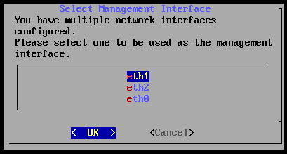

# Instalación del IPS de RedBorder


## Requisitos de la instalación

La implementación exitosa de RedBorder requiere una máquina con el sistema operativo **Rocky Linux 9** instalado. Los requisitos de hardware de la máquina deben ser como mínimo:

=== "IPS"

    * Disco: 50 GB
    * RAM: 16 GB
    * CPU: 4 núcleos
    * Interfaces de red: Al menos dos

## Proceso de instalación

La primera acción para comenzar a monitorizar tu red con RedBorder es obtener los paquetes oficiales más recientes de redBorder para **Rocky Linux 9** disponibles en [repo.redborder.com](https://repo.redborder.com).

``` bash title="Latest"
dnf install epel-release && rpm -ivh https://repo.redborder.com/ng/latest/rhel/9/x86_64/redborder-repo-1.0.0-1.el9.rb.noarch.rpm
```

``` bash title="IPS"
dnf install redborder-ips
```

Ya con los paquetes descargados e instalados, el siguiente paso es configurar RedBorder, para ello cerramos la sesión en consola y volvemos a iniciarla, esto actualizará las rutas a los scripts y así podremos ejecutar el comando:

WARNING: la configuración con el wizard no se puede hacer a través de SSH

    rb_setup_wizard

El cual iniciará el **asistente de instalación** de la plataforma en consola para funcionar como guía durante todo el proceso. La primera confirmación que aparecerá nos resume el orden del los pasos de la instalación.


### Configuración de red

Normalización del nombre de las interfaces

Después de confirmar, el IPS se reiniciará y podremos reaundar la instalación con 

    rb_setup_wizard


En el recuadro inferior se listan las interfaces de red existentes en el equipo en cuestión. Debajo de todas las interfaces que posee el equipo, está la opción `Finalize`, que podemos seleccionar **después de haber configurado** exitosamente las interfaces.


Configuración de red

Al seleccionar una interfaz y entrar en ella, se nos da la opción de configurarla con una dirección IP estática o que esta funcione dinámicamente (con DHCP).


Configuración de interfaz de red

En caso de seleccionar la opción de IP estática, se deberá especificar la IP, la máscara de red y la puerta de enlace por defecto:


Configuración de interfaz estática

INFO: Si queremos cambiar el modo, seleccionamos la opción y pulsamos la tecla ESPACIO

### Configuración de DNS

El asistente de instalación te dará la opción de elegir si quieres o no configurar servidores DNS. Si se desea configurar un DNS.

Es obligatorio configurar al menos un servidor, sin embargo, actualmente es posible configurar hasta 3 servidores DNS en la plataforma. Esto se puede hacer en la siguiente pantalla:


Configuración de DNS

### Selección de la interfaz de administración

Se nos pedirá que seleccionamos una de las interfaces como interfaz de administración. Mientras que la interfaz de administración servirá para conectarse con otras máquinas de redborder o con equipos de administración, el resto de interfaces se ocuparán de leer y trasmitir tráfico.

!!! info "Recomendación"
Se recomienda utilizar la eth0 como interfaz de administración, y así queda claro qué la primera es la interfaz de administración



Selección de la interfaz de administración

### Configuración de segmentos

Los segmentos identifican aquellas redes a las que el IPS tiene acceso y sobre las cuales va a actuar como dispositivo de seguridad en red. Sobre las interfaces, es necesario declarar al menos un segmento, para que el IPS esté operativo.


!!! important "Reservar la interfaz principal a administración y no asignarle ningún segmento"
Una vez hayamos configurado los segmentos.

### Nombre de host y dominio

Durante la instalación, se da la opción de decidir cuál será el nombre de host para el nodo de RedBorder, así como también el dominio utilizado para la comunicación con posibles servidores Proxy de RedBorder o IPS de RedBorder.

El nombre de host a escoger debe respetar el estandar **RFC1123**.

!!! info "Ten en cuenta..."
    El asistente de instalación genera automáticamente un nombre de host aleatorio para la máquina, así como también indica un nombre de dominio por defecto, que se recomienda no cambiar a menos que sea necesario, con el fin de que pueda registrarse contra los managers


Configuración de hostname y dominio

### Finalizando la configuración

Para finalizar el proceso de instalación, el IPS necesita un poco de tiempo, pero eventualmente nos devolverá a la consola, confirmando que se ha 


