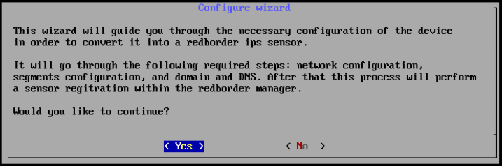
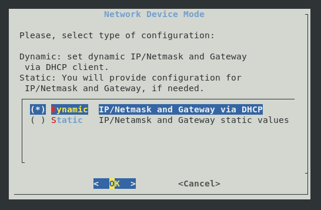
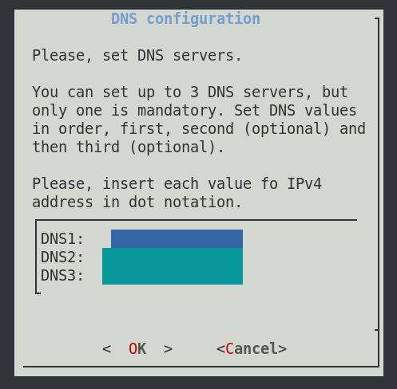
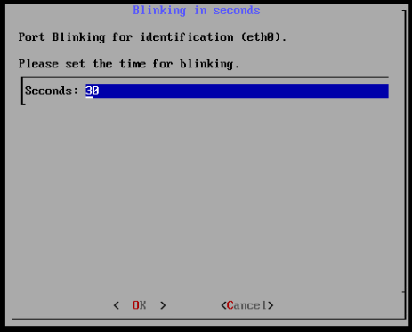
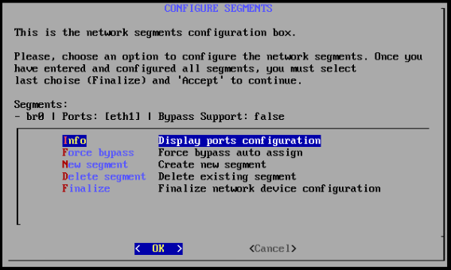
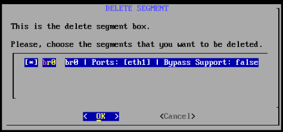
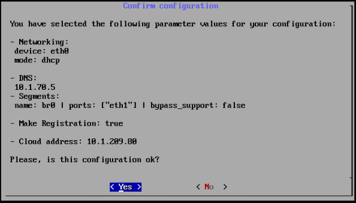
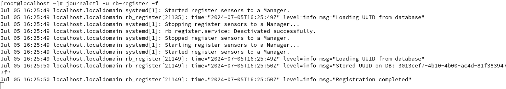
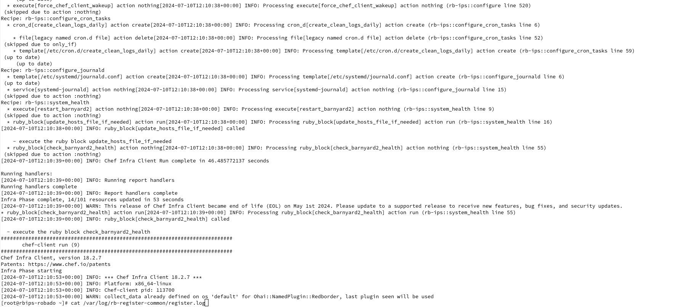

# Instalación del IPS de RedBorder

A continuación se detalla la instalación de base de un IPS de Redborder con el que poder analizar tráfico para detectar intrusiones en él. Debido a que es un trabajo específico y con una gran carga, se considera necesario tener una máquina instalada para ese propósito. 

Existen dos modos de instalación para el IPS: la versión mínima que emula el comportamiento del **proxy** y la versión integrada en un nodo que actúa, además de IPS, como **manager**. En función de cómo vayamos a instalar el IPS, utilizaremos uno u otro.

## Requisitos de la instalación

La implementación exitosa del IPS de RedBorder requiere una máquina con el sistema operativo **Rocky Linux 9** instalado. Adicionalmente, será necesaria la preinstalación de un **Manager** de Redborder contra el que registrar el IPS. Estos son los especificaciones de este IPS:

=== "Recomendado"

    * Disco: 50 GB
    * RAM: 16 GB
    * CPU: 4 núcleos
    * Interfaces de red: Al menos dos

## Proceso de instalación

La primera acción para comenzar a monitorizar tu red con RedBorder es obtener los paquetes oficiales más recientes de redBorder para **Rocky Linux 9** disponibles en [repo.redborder.com](https://repo.redborder.com).

``` bash title="Latest"
dnf install epel-release -y && rpm -ivh https://repo.redborder.com/ng/latest/rhel/9/x86_64/redborder-repo-1.0.0-1.el9.rb.noarch.rpm
```

``` bash title="IPS"
dnf install redborder-ips -y
```

Ya con los paquetes descargados e instalados, el siguiente paso es configurar RedBorder, para ello reniciamos la sesión en consola:

``` bash title="Comando de reinicio de consola"
/bin/bash --login
```

Esto actualizará las rutas a los scripts y así podremos ejecutar el comando de instalación:

!!! warning "Si está conectado a la máquina de manera remota..."
    El asistente de instalación no puede ser lanzado a través de SSH. En caso de estar virtualizado, utilize la consola proporcionada por el propio entorno de virtualización. Sino, tendrá que conectarse directamente a la máquina física.

``` bash title="Comando de instalación del programa de Redborder"
rb_setup_wizard
```

El cual iniciará el **asistente de instalación** de la plataforma en consola para funcionar como guía durante todo el proceso.

## Asistente de instalación

Habiendo iniciado el **asistente de instalación** para la plataforma en la consola, se puede utilizar como guía durante todo el proceso. La primera pantalla que se muestra nos ofrece también un índice de los próximos pasos.



Iniciando el asistente

Si no está seguro sobre la configuración actual, puede cancelar con la opción "No", la cual mostrará la siguiente pantalla antes de volver a la vista de la consola.

### Configuración de red

#### Normalización del nombre de las interfaces


Normalización del nombre de las interfaces

Después de confirmar, el IPS se reiniciará y podremos reanudar lanzando de nuevo el asistente:

``` bash title="Comando de instalación del programa de Redborder"
rb_setup_wizard
```

En el recuadro inferior se listan las interfaces de red existentes en el equipo en cuestión. Debajo de todas las interfaces que posee el equipo, está la opción `Finalize`, que podemos seleccionar **después de haber configurado** exitosamente las interfaces.


Configuración de red

Al seleccionar una interfaz y entrar en ella, se nos da la opción de configurarla con una dirección IP estática o que esta funcione dinámicamente (con DHCP).



Configuración de interfaz de red

En caso de seleccionar la opción de IP estática, se deberá especificar la IP, la máscara de red y la puerta de enlace por defecto:


Configuración de interfaz estática

### Configuración de DNS

El asistente de instalación nos dará la opción de elegir si quieremos configurar servidores DNS. Es obligatorio configurar al menos un servidor, sin embargo, actualmente es posible configurar hasta 3 servidores DNS en la plataforma. Esto se puede hacer en la siguiente pantalla:



Configuración de DNS

### Configuración de segmentos

Los segmentos identifican aquellas redes a las que el IPS tiene acceso y sobre las cuales va a actuar como dispositivo de seguridad en red. Sobre las interfaces, es necesario declarar al menos un segmento, para que el IPS esté operativo.


#### Info

En info podremos ver la información relativa a cada interfaz de red, e incluso la podremos indentificar en la tarjeta de red física. Esto es útil para decidir cuáles van a ser los segmentos activos y qué debe conectarse físicamente con qué:


Información de segmentos

Al seleccionar una interfaz, deberemos elegir un tiempo de parpadeo de la interfaz física de red, lo que nos ayudará a identificarla en la máquina física en cuestión:



Parpadeo de interfaces

!!! important "Si selecciona una de las interfaces..."
    Puede volver a la configuración de segmentos pulsando **ESC** o elegir la duración de parpadeo. Durante el parpadeo de la interfaz, el proceso de instalación no continuará.

#### Force bypass (WIP)

#### Nuevo segmento

Para asignar un nuevo segmento, debemos seleccionar una de las interfaces disponibles

!!! important "En cuanto a la interfaz de administración..."
    Debe reservar la interfaz principal de administración y no debe ser asignada como segmento.


Crear un nuevo segmento

La creación de un nuevo segmento va a ser mostrado en una lista previa:



Nuevo segmento en la lista

#### Eliminar segmento

En el caso en el que queramos hacer la acción contraria, podemos eliminar los segmentos que queramos de la lista. Podemos seleccionar los que queramos eliminar:



Eliminación de segmentos

Y desaparecerán de la lista previa:


Configuración de segmentos

#### Finalizar la configuración de segmentos

Cuando hayamos configurado los segmentos deseados. Pulsamos **finalizar**.

## Modo del nodo

En este punto tenemos que elegir en qué modo va a actuar el IPS:


Configuración de registro del IPS

En el caso de proxy, el asistente nos pedirá la dirección de un manager contra el que registrarse. Por otro lado, en modo manager, el asistente nos pedirá la dirección del manager **que hace de servidor web**; así que nos pedirá también las **credenciales** del usuario **administrador** que está registrando este IPS.

!!! info "Tenga en cuenta..."
    La configuración del IPS en modo manager supondrá el registro automático del sensor contra la web.

### Modo proxy: Configuración con el servidor remoto

El ips se asociará a un manager o clúster con el que compartir los datos capturados. Para que se pueda asociar es necesario indicar la dirección del manager o clúster. Se puede indicar tanto una dirección de dominio como una IP.


Configuración con el servidor remoto

### Modo manager: Registro contra la web

El ips se asociará a un manager que aloje la web. Para que se pueda asociar es necesario indicar la dirección del manager y las credenciales de un usuario con permisos de administración. Adicionalmente, podemos modificar el nombre del sensor cuando se registre en la web:


Configuración de registro del IPS

Al pulsar OK, nos pedirá la contraseña de administrador registrado en la **web**:


Contraseña de usuario web

### Fin de la configuración

Antes de aplicar la configuración, el asistente nos resumirá toda la información rellenada, a la espera de que el usuario la acepte.



Aceptar configuración

### Fin de la instalación

La instalación casi ha terminado, sólo hay que esperar a que el proceso finalice.


Aplicando Configuración

Pulse "OK" para volver a la vista de consola.

Adicionalmente, puede observar los logs del proceso de registro con el manager mediante el comando correspondiente

#### Modo Proxy

``` bash title="Mostrar los logs de registro"
journalctl -u rb-register -f
```

Al final del proceso de instalación journal mostrará logs de registro:



#### Modo Manager

``` bash title="Mostrar los logs de registro"
cat /var/log/rb-register-common/register.log
```
Al final del proceso de instalación journal mostrará logs de registro:



## ¿Qué es lo siguiente?

En el siguiente capítulo terminaremos de asociar el IPS al manager para que pueda tomar el tráfico y alertar de las intrusiones detectadas en él. Todo ello gestionable desde la web.

!!! info "Si instaló el IPS en modo manager..."
    Recuerde que si ha instalado el ips en modo manager, el proceso de asociación ya debe haber finalizado
