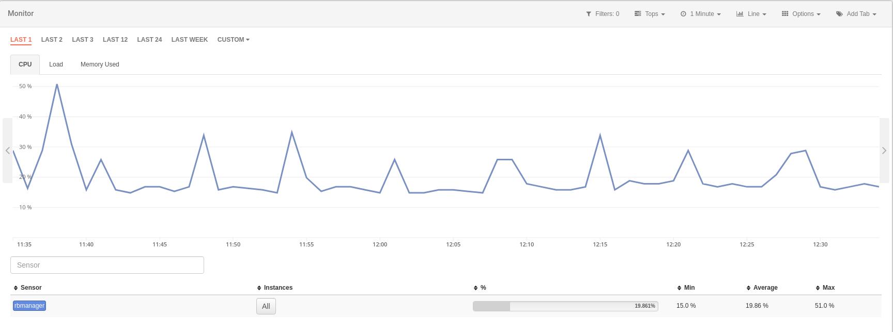

# Apps Overview

Redborder ofrece la máxima visibilidad de red gracias a las muchas opciones de representación y visualización de datos que nuestras Apps proveen.

La plataforma tiene una App (también conocidas como módulos) para cada funcionalidad. Cada una utiliza diferentes tecnologías y tiene una interfaz independiente. Todos los módulos necesitan un sensor que le provea de datos.

## Tráfico

El módulo **Tráfico** utiliza netflow para extraer información sobre todo el tráfico del sensor. El módulo provee información como IPs, protocolos, localizaciones y mucho más.

## Intrusion

El módulo **Intrusión** utiliza datos del sensor o sensores IPS para mostrar eventos de intrusión basados en reglas de Snort. También, gracias a las diferentes vistas que incluye Redborder, es posible analizar los paquetes que coincidieron con la especificación de la regla.

## Monitor

El módulo **Monitor** utiliza datos provenientes de protocolos SNMP, Redfish e Ipmi para mostrar el estado de la infraestructura.

## Vault

El módulo **Vault** utiliza datos de syslog para proveer información sobre eventos de diferentes orígenes, tales como categoría, objetivo, acción del evento y más.

También es posible aumentar las capacidades del módulo Vault a través de las extensiones que añaden compatibilidades con otros fabricantes.

## Movilidad

El módulo **Movilidad** provee información de localización de sensores de APs de la red. Puede ser usado para mostrar como las personas se mueven en un edificio.

