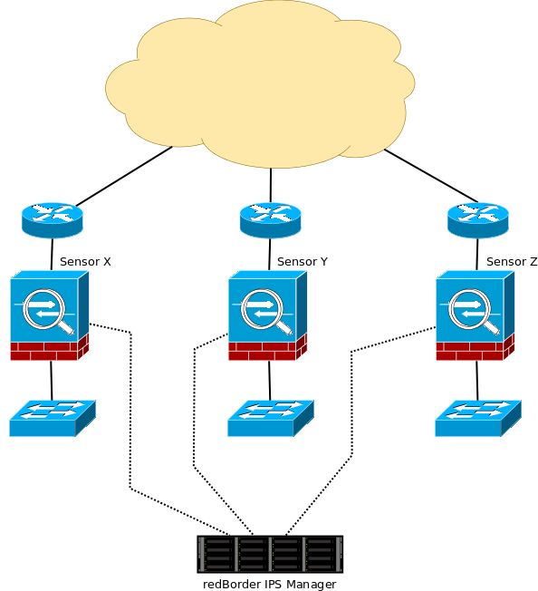
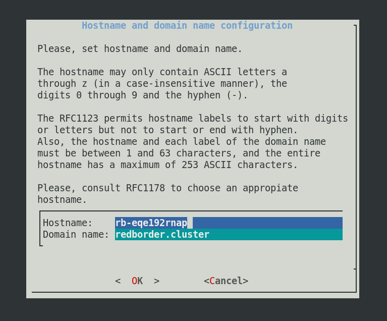
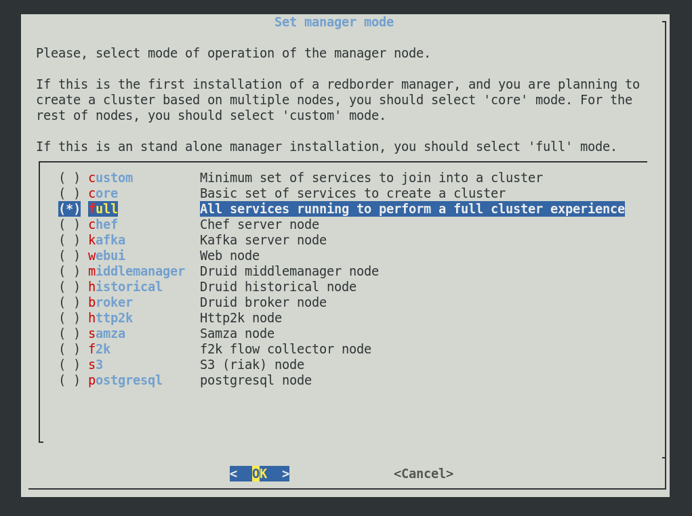
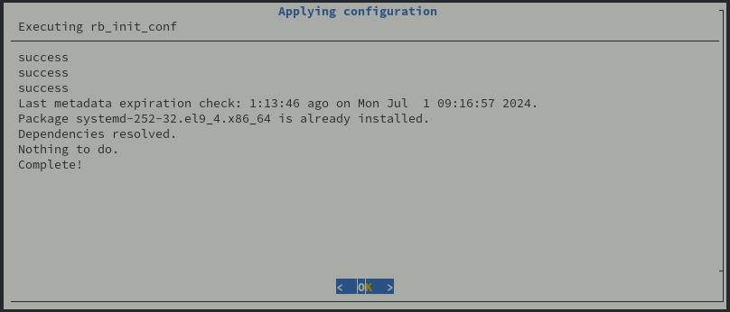

# Instalación del manager de Redborder

Bienvenido al proceso de instalación de Redborder.

Instalar el Manager de Redborder es el primer paso para empezar a monitorizar y proteger la información de su red gracias a la solución de Redborder. Debe verificar el contenido de este capítulo antes de comenzar la instalación de la plataforma (también conocido como el Manager de Redborder).

!!! tip "Se recomienda..."
    Tener un conocimiento mínimo de la red, así como sobre conceptos básicos de redes.

## Escenario básico para la instalación de Redborder

Un escenario básico típico propuesto por la solución consiste en un conjunto de sensores dispuestos en diferentes puntos sensibles de la red de la organización que conectarán con un Manager o clúster de managers para su gestión y monitorización.

Dichos puntos están formados por enlaces de red, llamados segmentos, por los que circulará el tráfico sensible y que el sensor analizará de manera más o menos transparente, en función del modo de funcionamiento configurado (IPS/IDS o Flow).

Para la planificación de la instalación de los sensores, se deberán tener en cuenta algunos aspectos fundamentales:

- **Los segmentos bypass** (interfaces específicas de red pareadas, normalmente con soporte bypass) se interpondrán en medio del tráfico a analizar.
- **Las interfaces de gestión** (en forma de bonding) para acceso remoto tanto desde equipos normales como desde el Manager.
- **Las interfaces de acceso IPMI para la gestión remota del hardware** (conexión SOL ó Serial Over Lan, iKVM y comandos IPMI como inicio, reinicio y apagado).

Para el **Manager** no es necesario un hardware específico, la única condición es **la existencia de una o más interfaces de red.**

!!! info "Ten en cuenta..."

    En caso de que se haya creado un **clúster** son necesarias dos interfaces de red: una para la red de gestión (Management IP Address) y otra para la red de sincronismo (Sync IP address).

De esta manera se permite la creación de un bonding para la gestión y conexión con los sensores y otro bonding (opcional) para sus comunicaciones hacia otras redes. Ambos sistemas soportan el estándar 802.1q para virtual LAN (opcional a la hora de configurar).

!!! warning "Importante"

    Es **importante** que primero se realice la configuración del Manager (o clúster de managers) antes de configurar los sensores.
    
    El Manager debe estar operativo y en una red accesible a los sensores. Algunos de los procesos de configuración de los sensores dependen del acceso al Manager.



Escenario básico para la instalación del Manager

## Estructura de la interfaz de usuario del asistente de instalación

Para nuestra nueva versión de redborder NG hemos renovado por completo el asistente de instalación. Ahora contamos con un asistente más intuitivo y sencillo de utilizar, además de configuraciones nuevas para las nuevas adiciones a la plataforma.


Pantalla inicial del asistente de instalación

!!! info "Ten en cuenta..."
    De momento, solo está disponible el asistente de instalación en el **idioma inglés**

### Selección de opciones

Navegar por nuestro nuevo asistente de instalación es muy sencillo:

- Moverse entre las opciones disponibles: pulsa las **flechas del teclado**
- Marcar una casilla: pulsa la tecla de **espacio**.
- Seleccionar una opción: pulsa la tecla de **enter**.

## Requisitos de la instalación

!!! info "Ten en cuenta..."
    Si ejecuta la plataforma en un entorno virtual, es **posible que disminuya el rendimiento** en comparación con una implementación en una máquina física.

La implementación exitosa de Redborder requiere de al menos una máquina con el sistema operativo **Rocky Linux 9** instalado. Los requisitos de hardware dependerán de si instalamos un sólo manager o un cluster. Para cada caso, estos requisitos son:

=== "Un sólo manager"

    * Disco: 80 GB
    * RAM: 16 GB
    * CPU: 4 núcleos
    * Interfaz de red: Al menos una

=== "Cluster"
    * Al menos tres máquinas con las siguientes características:
        * Disco: 80 GB
        * RAM: 16 GB
        * CPU: 4 núcleos
        * Interfaces de red: Al menos dos

## Proceso de instalación

La primera acción para comenzar a monitorizar tu red con Redborder es obtener los paquetes oficiales más recientes de Redborder para **Rocky Linux 9** disponibles en [repo.redborder.com](https://repo.redborder.com).

!!! info "En el caso de instalar un cluster..."
    Todo el proceso de instalación especificado en esta página debe repetirse para cada manager que conformará el clúster.

``` bash title="Configuración de los repositorios requeridos"
dnf install epel-release && rpm -ivh https://repo.redborder.com/ng/24.11/rhel/9/x86_64/redborder-repo-24.11-0.0.1-1.el9.rb.noarch.rpm
```

``` bash title="Comando de instalación del paquete de manager Redborder"
dnf install redborder-manager
```

Ya con los paquetes descargados e instalados, el siguiente paso es configurar Redborder, para ello reniciamos la sesión en consola:

``` bash title="Comando de reinicio de consola"
/bin/bash --login
```

Esto actualizará las rutas a los scripts y así podremos ejecutar el comando de instalación:

``` bash title="Comando de instalación del programa de Redborder"
rb_setup_wizard
```

El cual iniciará el **asistente de instalación** de la plataforma en consola para funcionar como guía durante todo el proceso.

## Asistente de instalación

Habiendo iniciado el **asistente de instalación** para la plataforma en la consola, se puede utilizar como guía durante todo el proceso. La primera pantalla que se muestra nos ofrece también un índice de los próximos pasos.


Si no está seguro sobre la configuración actual, puede cancelar con la opción "No", la cual mostrará la siguiente pantalla antes de volver a la vista de la consola.


!!! warning "Cancelación..."
    La opción "No" cancelará todo el proceso de instalación, lo que significa que se perderá toda la configuración realizada durante el proceso.

!!! warning "Si está configurando un clúster..."
    Asegurese de completar esta guía *antes* de lanzar el asistente en los demás nodos.

!!! info
    De momento, solo está disponible el asistente de instalación en el **idioma inglés**

### Selección de opciones

Navegar por nuestro asistente de instalación es muy sencillo:

- Moverse entre las opciones disponibles: pulsa las **flechas del teclado**
- Marcar una casilla: pulsa la tecla de **espacio**.
- Seleccionar una opción: pulsa la tecla de **enter**.

### Configuración de red

Este paso es opcional. Si está seguro de que las interfaces de red ya están configuradas, puede omitir este paso. De lo contrario, entra en la configuración presionando "Sí".


En el recuadro inferior se listan las interfaces de red existentes en el equipo en cuestión. Debajo de todas las interfaces que posee el equipo, está la opción `Finalize`, que podemos seleccionar **después de haber configurado** exitosamente las interfaces.


Configuración de red

Al seleccionar una interfaz y entrar en ella, se nos da la opción de configurarla con una dirección IP estática o que esta funcione dinámicamente (con DHCP).


Configuración de interfaz de red

En caso de seleccionar la opción de IP estática, se deberá especificar la IP, la máscara de red y la puerta de enlace por defecto:


### Selección de interfaz de gestión

En caso de tener múltiples interfaces, necesita seleccionar cuál será la interfaz principal para operar con este gestor. El propósito de esta interfaz es configurar el gestor como lo está haciendo aquí, para luego vincularlo con los diferentes tipos de sensores.


### Configuración de DNS

El asistente de instalación le dará la opción de elegir si quiere o no configurar servidores DNS, si es que realmente se desea configurar un DNS.


Si necesita configurar DNS, configura al menos un servidor. Esto se puede hacer en la pantalla siguiente:


Configuración de DNS

### Nombre de host y dominio

Durante la instalación, se da la opción de decidir cuál será el nombre de host para el nodo de Redborder, así como también el dominio utilizado para la comunicación con posibles servidores Proxy de Redborder o IPS de Redborder.

El nombre de host a escoger debe respetar el estandar **RFC1123**.

!!! info "Tenga en cuenta..."
    El asistente de instalación genera automáticamente un nombre de host aleatorio para la máquina, así como también indica un nombre de dominio por defecto, que se recomienda no cambiar a menos que sea necesario.



Configuración de hostname y dominio

### Configuración de servicio de clústeres (Serf)

Redborder tiene la capacidad de trabajar de manera distribuida, repartiendo funciones o carga de trabajo entre dos o más nodos, a través de una red de sincronismo que permite a los nodos comunicarse y operar, para ello, empleamos **Serf**(1), es este servicio el que se encarga de crear el cluster de managers y definir los roles de los nodos.
{ .annotate }


Serf es una solución descentralizada para descubrimiento y orquestación de servicios que es ligera, altamente disponible y tolerante a fallos.

Para que Serf funcione correctamente, son necesarios tres parámetros: la selección de la red de sincronismo, configurar el modo de serf para localizar otros nodos y la creación de una clave.

#### Red de sincronismo

La red de sincronismo es la que utilizan todos los gestores para sincronizarse entre sí. En caso de que esté instalando un clúster, asegúrese de seleccionar una interfaz diferente a la de gestión.


#### Indicar el modo de Serf (Unicast / Multicast)


#### Clave secreta para encriptar el tráfico de red de Serf

Ponga una contraseña entre 6 y 20 caracteres para el Serf.


!!! warning "Si está configurando un clúster..."
    Esta contraseña debe ser la misma entre todos los managers que se unirán al mismo clúster. En caso de haber un segundo clúster en la misma red, defina una contraseña para cada clúster, para conseguir que cada manager se una al clúster correcto.

### Almacenamiento con Amazon S3 (WIP)

Cuando se realiza una instalación remota de Redborder en AWS, es posible también utilizar el servicio de almacenamiento remoto de Amazon con S3.

### Base de datos externa (WIP)

Es posible también, configurar Redborder para utilizar el servicio de Amazon RDS o alguna otra base de dados de PostgreSQL.

### Seleccionar el modo del manager

Dependiendo de la instalación de Redborder que desee realizar, puede indicar a la plataforma qué debe ejecutarse en el nodo que está instalando. El caso más común será la instalación en modo `full`, pero si desea ahorrar recursos, elija uno de los otros modos en su lugar. En caso de una instalación en clúster, uno de los nodos debe estar en modo `full`o `core`. Resumiendo la configuración para cada caso:

=== "Un sólo manager"
    Elija el modo `full`.

=== "Nodo líder"
    Elija el modo `full` de manera predeterminada, o el modo `core` para una instalación mínima.

=== "Nodo seguidor"
    Elija el modo `full` de manera predeterminada, o el modo deseado para ese nodo para una instalación mínima.



Elección de modo de manager

### Fin de la instalación

La instalación casi ha terminado, sólo hay que esperar a que el proceso finalice.



Pulse "OK" para volver a la vista de consola.

Adicionalmente, puede observar los logs de la installación lanzando el siguiente comando: 
``` bash title="Print the setup logs"
journalctl -u rb-bootstrap -f
```

!!! warning "Si está configurando un clúster..."
    Espere a que el servicio de bootstrap haya terminado con la instalación del primer nodo (master node) *antes* de lanzar rb_setup_wizard en los demás nodos (worker nodes).

Al final del proceso de instalación journal mostrará lo siguiente:

