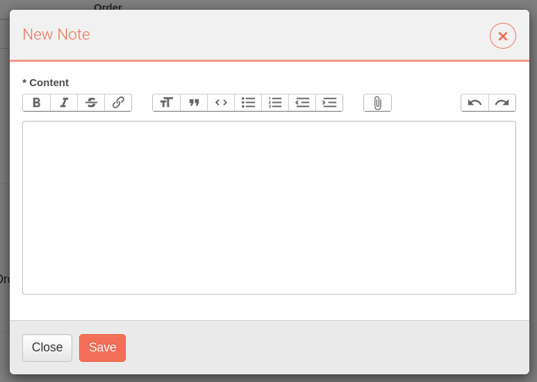

# Incidentes

Los incidentes son el punto de entrada principal de la plataforma RedBorder. Son el resultado del análisis de los eventos y alertas generados por el sistema que esperan ser revisados por el usuario, ya sea para ser reportados o descartados.

*Vista de incidentes*

## Partes de la vista

Puedes ver las diferentes partes de la vista en la imagen anterior:

* Una barra de búsqueda para encontrar un incidente.
* Una barra de filtros para filtrar los incidentes.
* La lista de incidentes.

Por defecto, no se aplica ningún filtro y la lista está ordenada por fecha, de más reciente a más antiguo.

## Campos de un incidente

Los campos de un incidente son los siguientes:

* ID: Identificador único del incidente.
* Prioridad: La prioridad del incidente a gestionar.
* Nombre: Un nombre explicativo del incidente.
* Source: La fuente de datos desde la cual se generó el incidente.
* Creado hace: La fecha y hora en que se detectó el incidente.
* Asignado: El usuario de la web que tiene actualmente asignado el incidente.
* Estado: El estado actual del incidente. Los valores posibles incluyen:

Los posibles estados son:

* Nuevo: El incidente ha sido creado pero aún no ha sido revisado.
* Abierto: El incidente está siendo investigado actualmente.
* Cerrado: La investigación del incidente está completa y no se requiere ninguna acción adicional.
* Contención exitosa: El incidente ha sido contenido y se ha evitado que se propague más.
* Incidente Reportado: El incidente ha sido oficialmente reportado a las partes interesadas o autoridades relevantes.
* Rechazado: Se ha determinado que el incidente es un falso positivo o no requiere acciones adicionales.
* Restauración exitosa: Los sistemas y datos afectados por el incidente han sido restaurados exitosamente.
* Detenido: La investigación o resolución del incidente se ha detenido temporalmente debido a varios factores.
## Acciones sobre un incidente

Las acciones que se pueden realizar sobre un incidente son las siguientes:

* Hacer clic en el nombre del incidente para ver los detalles del incidente.
* Hacer clic en la fuente del incidente para ir a la vista de la fuente del incidente.
* Hacer clic en el estado para cambiar el estado del incidente.
* Hacer clic en el icono de configuración para comenzar a gestionar el incidente.
* Hacer clic en el icono de papelera para eliminar el incidente.

Al hacer clic en el nombre del incidente se mostrarán los detalles del incidente, ampliando su explicación. Hacer clic en **Ver Detalle del Incidente** tendrá el mismo efecto que hacer clic en el icono de configuración. En ambos casos, si el estado del incidente era **Nuevo**, cambiará a **Abierto**; y el usuario será asignado a ti mismo.

*Resumen del incidente*

## Adentrándose en el incidente

El propósito principal de esta vista es proporcionar al usuario toda la información sobre el incidente y la posibilidad de documentar el proceso de **detección** y **respuesta**.

*Detalle del incidente*

### Vista general

La visión general del incidente muestra la siguiente información relacionada con el incidente:
* La lista de **activos**.
* La lista de **observables**.
* La lista de **indicadores**.

Además, la información se resume en una vista de gráfico interactivo que permite al usuario ver la conexión entre los observables.

*Visión general del incidente*

### Detección

La sección de detección muestra la lista de alertas relacionadas (mensajes), observables y activos que componen el incidente.

*Detección del incidente*

### Respuesta

La sección de respuesta muestra un **playbook**, que es una guía estructurada para manejar el incidente. Un playbook proporciona un enfoque sistemático para la respuesta a incidentes, asegurando que todos los pasos necesarios se sigan de manera consistente. Hay diferentes tipos de playbooks, que se definen por el tipo de incidente. El playbook se divide en fases. Cada fase puede tener diferentes tareas a realizar, y cada tarea tiene una descripción y un espacio específico para escribir los comentarios del proceso de respuesta. Se espera que los usuarios ejecuten las fases y tareas en el orden propuesto.

*Respuesta del incidente*

En este ejemplo, el playbook tiene cuatro fases: **Identificación**, **Contención**, **Erradicación** y **Recuperación**. Cada fase tiene una lista de tareas a realizar en orden. El usuario puede agregar comentarios a las tareas y marcarlas como completadas.

### Worklog

El worklog es un registro de las acciones realizadas por cada usuario que trabajó en el incidente. Cualquier cambio en él se registrará y se podrá filtrar y mostrar aquí. Además, cualquier usuario puede agregar comentarios manualmente al worklog según sea necesario.

*Worklog*

#### Búsqueda en el worklog

Los **registros** se pueden filtrar por **Tipo** y **Usuario**, y ordenar por fecha. Hay tres tipos de registros:
* Cambios en el incidente: Estos registros son generados automáticamente por el sistema cuando cambia el estado del incidente, como cuando cambia el estado o el usuario.
* Registros de respuesta: Estos son agregados manualmente por el usuario durante el proceso de investigación y respuesta.
* Notas: Además, el usuario puede agregar notas manualmente al worklog. Útil cuando la información detallada no encaja en el resto de los tipos.

#### Agregar notas

Además, el usuario puede agregar notas al worklog. Al hacer clic en **Agregar Nota**, aparecerá el editor de texto para agregar la nota. La nota se agregará al worklog después de hacer clic en **Guardar**. El editor de texto tiene características útiles como:
* Insertar enlaces
* Insertar bloques de código y otro texto formateado
* Adjuntar archivos
* Entre otras opciones

*Agregar nota*

# ¿Qué es lo siguiente?

Ve a la sección de **Incidentes** para comenzar a gestionar un incidente. El playbook probablemente te guiará para ver la **fuente** del incidente. O ve a **Herramientas/Playbooks** para definir nuevos playbooks para nuevos tipos de incidentes.
