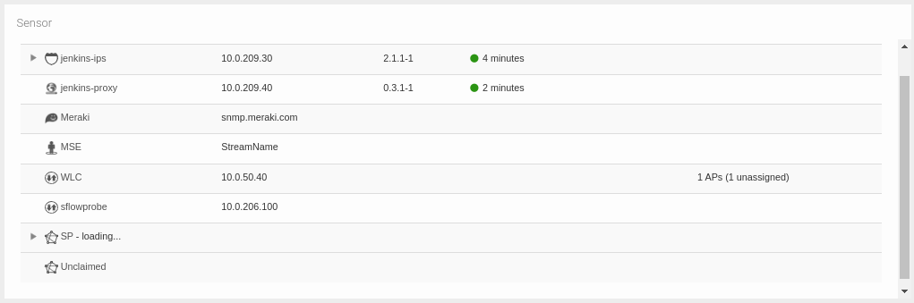

# Dashboards and Widgets View

This chapter explains how to view dashboards and what information is contained in the widgets that compose them. However, instructions for managing dashboards and widgets will be explained in [platform configuration section](../platform_configurations/ch7_5_dashboards_administration.md).

Dashboards allow you to have a visual summary that includes the main KPIs (Key Performance Indicators) that are necessary to analyze the network infrastructure. The user can combine widgets to obtain valuable information about trends, changes, and exceptions associated with the traffic that occurs on or passes through the network. These visual control panels provide an overview and summary of important data on a single screen, allowing users to visualize and monitor key information quickly and efficiently in the context of Redborder Manager.

*Redborder default dashboard*

## Accessing dashboards

Dashboards are accessible directly from the first menu in the header: Initially, it will display the name of the dashboard that has been set as default, and it will always show the name of the currently selected dashboard. The default one is called **General View** and shows a map of the sensors' location.

When expanding the menu, the **options menu** will appear, which will be explained in the next section.

*Dashboard options menu*

Additionally, you can access specific dashboards in the following ways:

- Using the **Dashboard URL**, which you can copy from the *Dashboard URL* option in the interface.
- If you have set a dashboard as **default**, it will automatically load when you log in.

!!! warning "You will only be able to view if..."
    You will only be able to view certain dashboards if the dashboard owners have granted you access and if you belong to the allowed domain.

## Dashboard options

The first option we find in the menu bar in the analysis area is *Dashboard*. This is the default selected option that you will see as soon as you log into the Redborder Manager.

*Dashboard overview*

The Dashboard section presents different options:

- **List of available dashboards**: at the top, the user will see the dashboards created and available for their profile. Next to each dashboard, there are two icons; the first one (wrench) allows us to view and edit the general configuration of the dashboard. The "Copy" icon on the right will allow us to clone the selected dashboard.
- **Dashboard URL**: gives the user a quick way to copy the URL of the current dashboard to share it.
- **Time machine**: allows the user to view the results of metrics from a particular day and time as if it were their real-time.

The rest of the options will be explained in detail in [platform configuration](../platform_configurations/ch7_5_dashboards_administration.md).

*Dashboard options*

## Types of widgets

Widgets are individual and modular components that form part of a dashboard. Each widget represents a specific set of data or metrics, usually in the form of graphs, tables, indicators, or any other visual representation. Widgets are customizable and can be added, removed, or rearranged within a dashboard to suit the specific needs of each user or team.

Widgets are categorized into different types as there is a wide variety of them. Most relate directly to a specific module; the rest either display advanced information or simply enhance the visualization of the dashboard itself. The categories of these widgets have been organized into two in this explanation, module widgets and the rest:

*Clients Widget (no data)*

### Module widgets

Widgets associated with modules display specific information from the respective module in question.

- Traffic
- Intrusion
- Mobility
- Scanner
- Vault
- Wireless

### Advanced widgets

The rest of the widgets do not interact directly with a single module, but rather focus on providing context to the visualization in general.

- **Mitre**: Summarizes triggered rules according to their relationship with MITRE terminology (tactics, techniques, and procedures).
- **Shapes**: Completes the structure of dashboards with uncategorized elements, such as shapes, images, text, or URLs.
- **Combination**: Allows visualization of data from other modules when the specific widget is not defined in the rest of the modules.

Select widget type

### Module widgets

For each module, there are widgets extracted generically from the views and others that are exclusive to those modules. Let's see what each one does and what they are used for.

#### Generic widgets

Generic widgets are found in more than one module and can be explained as a whole:

- **Raw**: Shows a customizable view of raw, which has disaggregated data.
- **Tops**: Displays a customizable view of the most prominent events, aggregating data to show totals for different events as a single entry.
- **Compare**: Presents a customizable view for comparing data over time (hours, days, weeks, and months). For example, it can be used to compare traffic evolution for a particular application across different **days**.
- **Individual indicator**: Shows the number of unique values that have been found for the selected field.
These widgets have the additional advantage that they can use other types of graphs to display information differently from the views within the modules.
<!-- - Grouped indicators -->
- **Performance Index**: Shows a 3-level categorization of the value of an aggregation for samples in a specific time interval, without delving into the widget type.

*Generic widgets*

#### Traffic

For traffic, we have the following specific widgets:

<!-- - *Bandwidth Line* -->
- **Clients**: Shows the clients associated with the network, especially useful when wanting to visualize access points.
- **Floor map**: Shows the floor plan of a building, and on it, the location of network architecture elements, such as access points or other network devices.
- **Heat map**: Shows a section of the global map on which information about network devices can be overlaid, such as the coverage provided by access points.
- **Map**: Shows a section of the global map.
- **Clients Map**: Shows a section of the global map. With information on clients connected to geolocated **access points**.
<!-- - *Access Points*: Shows information associated with access points associated with a traffic sensor. -->
<!-- - *Channel load*: Shows the load that network devices have. -->

###### Clients

It will read the clients field and display statistical information about those found in network traffic.

*Clients Widget*

###### Floor maps

Floor maps have an associated **floor**. This, in turn, has an architectural image of the floor, which is shown in the widget.

*Floor map widget*

###### Geographic maps

The map, heat map, and client map widgets are part of the geographic maps set. They can be displayed in both satellite and photographic views.

*Map widget*

#### Intrusion

There are no specific widgets for this module.

<!-- #### Mobility -->

<!-- - Movements: -->
<!-- - Heat map: Shows a map -->

<!-- #### Malware

Los widget de tipo Malware se asocian al análisis de eventos Malware ocurridos en cualquier parte de la infraestructura redborder.

Widgets de malware

Pueden resumirse en la siguiente lista:

1. *Score average per hour*: puntuación media de los eventos de malware detectados en las últimas 24 horas.
- *Malware Fast Search*: widget que permite la busqueda de un evento malware por hash, url o ip.
- *Recent Malware*: muestra eventos de malware detectados en las últimas 24 horas. -->

#### Scanner

There are no specific widgets for this module.

#### Vault

There are no specific widgets for this module.

#### Wireless

There are no specific widgets for this module.

#### Infrastructure

- **Sensor**: Shows the configuration of the sensors.
- **Cluster**: Shows the status of services in each **manager** associated with the platform.
- **Alarm**: Shows the set of alarms that have been activated at some point. Also, provides direct access to the alarm configuration panel.
- **Hardware info**: Displays information regarding the device (chassis, processor, pcie).
- **Hardware status**: Indicates if the device is functioning correctly along with an identifying image of it.
- **Monitor**: Monitors a specific hardware property of network devices.

##### Sensor

The available sensor tree can be viewed and its configuration can be accessed directly.

*Sensor widget*

##### Cluster

The status of services for each **manager** can be viewed and it provides direct access to the **cluster configuration**.

*Cluster widget*

##### Alarm

Alarms that have been triggered at some point can be viewed and it provides direct access to the **alarm configuration**.

*Alarm widget* 

<!-- ##### Hardware info -->

<!-- ##### Hardware status -->

##### Monitor

Based on the chosen graph type, it will display

*Monitor widget*

## Time machine

This option returns to the state of the machine during the day and time that has been determined. The user will see the data as if it were in real-time, but in reality, only the temporal reference has been changed to the one indicated in the **time machine**.

This *time travel* offers us a maximum degree of precision in the analysis because it can indicate the exact minute you want to consult.

*Time machine*

## What's next?

If you want to configure your own dashboards, see the documentation section titled **Dashboard and Widget Administration** in **platform configuration**.
