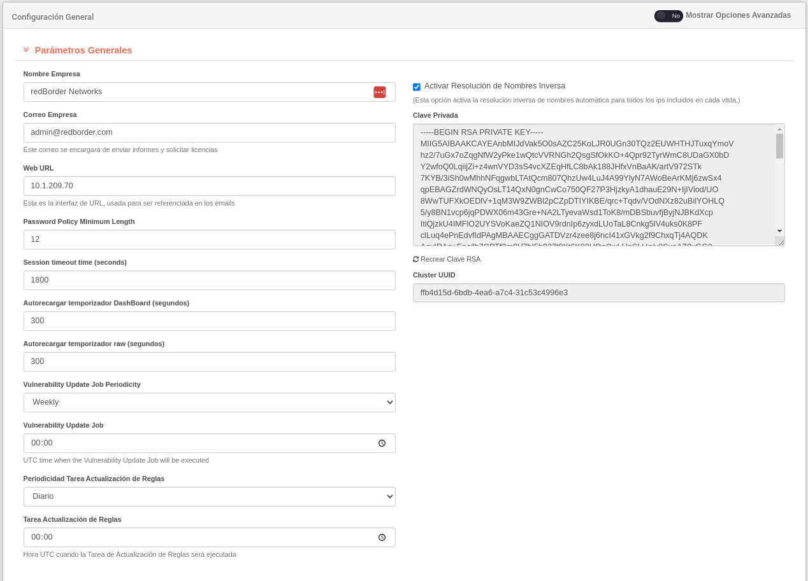

# General Configuration

The **General Configuration** option in the **Tools** section of the configuration area in the menu bar provides an interface for both platform configuration and network infrastructure.

General Configuration: General Configuration of Redborder Manager

!!! info "Keep in mind..."
    To view all sections, it is recommended to enable the **Show advanced options** located at the top right of the screen in the general configuration.

    In this screen, you can edit the parameters of both the Manager and the modules that have been registered. The sections displayed will depend on the modules integrated into the Redborder platform.

For basic configuration in the Manager, the user can edit general parameters, application features, server settings, network, routes, IP geolocation, among other parameters.

Let's go through the general categories available in the general configuration:

## General Parameters

In this section, the user can change the following elements:

- Company Name: name of the company using Redborder.
- Company Email: email address of the company. It will be used as the sender of reports and license management.
- Web *URL*: this is the interface *URL*, used for referencing in emails.
- Minimum Password Length: indicates the minimum number of characters a password must have to be accepted on the platform.
- Session Timeout: time in seconds that the platform will wait to log out an inactive user.
- Dashboard Refresh Time: period for refreshing the dashboard in seconds.
- Raw Automatic Reload Time: update period for the interface in seconds.
- Vulnerability Information Update Frequency: frequency for updating available information about vulnerabilities.
- Vulnerability Information Update Time: UTC time at which the update job for vulnerability information will run.
- Snort Rules Update Frequency: frequency for updating the rules.
- Snort Rules Update Time: UTC time at which the rule update job will run.

!!! warning "Important"

    All parameters defined in this interface are inherited by those elements at lower dependent levels (domains, sensors). To modify this information, the user must write or edit it.

## Banner

This section allows the user to add desired text to the login screen for the web via the *Login Screen Banner* field. It is also possible to add a banner to the console login via the *Console Line Banner* field.

By default, these fields do not contain text, so no message will be displayed during login.

## HTTP SSL Certificates

Allows setting SSL certificates for secure communications.

## Servers

Configuration of Syslog, MTA, NTP servers, and enabling proxy configuration.

## Default Rules

Configuration of default rules for loading or dropping data.

## Monitoring and Logs

This section helps monitor the Redborder infrastructure. In the *Syslog Servers* field, you must specify which remote server the logs will be sent to.

You must select which protocol and Syslog mode you want to use for the sends.

!!! info "Keep in mind"
    *TCP* protocol is recommended to ensure secure sending. Choose this option whenever possible.

The *New Relic* section allows reporting to the *New Relic* cloud. In this case, the user must provide their *New Relic* license number and, if they have a cluster group, enter its name.

Enabling the *Enable Plugins* verification is optional because this is a paid service. Activate *Enable APM* for web monitoring.

## Amazon Cloudwatch

If the user wants to send their logs to this Amazon service, the required fields must be completed.

## Google Maps API

It is possible to link Redborder with the Google Maps API to obtain better location information.

## Backup Segments (WIP, Remote S3)

Allows user data backup on a remote server or database. For this, the host name, bucket, and secret access key must be provided.

## Outliers

To activate anomaly detection, expand the *Outliers* section and click **Enable anomaly detection functionality**.

To disable the option, simply uncheck it.

## OpenWeatherMap

OpenWeatherMap is used in the mobility pipeline to enrich mobility data with weather information. This field allows the user to write down their OperWeatherMap API key to accomplish the enrichment.

## White Networks

In this section, networks whose traffic will pass without packet inspection because they are considered "trusted" can be specified.

**Add a new network**: click the **Add** button and provide the network IP.

To remove a network from the list, use the **Delete** icon.

## Black Networks

List of networks whose traffic should be blocked due to poor reputation.

**Add a new network**: click the **Add** button and provide the network IP.

To remove a network from the list, use the **Delete** icon.

## Network Routes

In this section, the user will define the network routes for the Manager.

**Add a new network**: click the **Add** button and provide the network IP route.

To remove a network route from the list, use the **Delete** icon.

## Fixed Hosts

In this section, the user will define the network routes for the Manager.

**Add a new network**: click the **Add** button and provide the network IP.

To remove a network from the list, use the **Delete** icon.

## GeoIP

To enable *Geo Protection* functionality, it is necessary to have an updated geolocation database to avoid errors in IP geolocation. Redborder is configured to support only the Maxmind database format.

These are the types of databases supported for IPv4 and IPv6 versions (old GeoIp binary format):

- **Country**: determines the country of an Internet visitor based on their IP address.
- **City**: provides the country, subdivisions, city, postal code, latitude, and longitude associated with worldwide IPv4 and IPv6 addresses.
- **ASN**: the *GeoIP2* anonymous IP database contains data on IP addresses used by anonymizing networks in various ways.

Download all files from the Maxmind website and unzip them. Only files with .dat format can be uploaded. To do this, click **Select file**.

## Logstash Tunning

In this section, the user can select different additional steps for data enrichment in logstash from the web interface (available for Traffic, Intrusion, and Mobility modules). Disabling these options would improve resource management and overall performance but would lose the functionalities described below. It is recommended to keep them active.

- **MAC Scrambling**: allows protecting the sensor's MAC; for this, a hexadecimal encoded key is used, which combines with a fake MAC. This allows obtaining the sensor's real MAC and provides security to not compromise the service provided.
- **Geo IP**: Allows protecting the sensor's MAC; for this, a hexadecimal encoded key is used, which combines with a fake MAC to obtain the real MAC.
- **MAC Vendor**: the translation process of the MAC included in the event allows obtaining the device manufacturer's name. This process is compared in a file stored within the system.
- **Darklist**: it is a service that retrieves a list of malicious IPs and stores multiple values such as score, threat type, country, latitude, longitude... in the system, allowing operations on event fields. The files are updated daily.

## Widgets Overview

With this configuration, the user can choose which information will be displayed in the left sidebar of the general view when entering the web platform. All that the user has to do is check or uncheck the desired widgets for them to be removed or added to the *Overview*. All the widgets are enabled by default.
