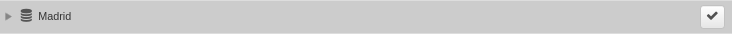
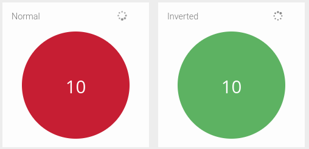

# Administración de Dashboards y Widgets

En la sección **Dashboards** el usuario puede crear una gran variedad de **Widgets** que muestren información específica que capture la plataforma, ya sea para llevar a cabo una monitorización eficiente o por mera organización de estos componentes. La idea es que tanto usuario como organización puedan tener un mejor control del análisis de datos desde una única pantalla.

## Requerimientos

La mayoría de los widgets van a requerir de algún tipo de **sensor** o **herramienta** operativos para que sean funcionales. Sabremos cuál en base a que los widgets están categorizados por módulos. Implicitamente, para que un sensor se encuentre operativo, es necesario que el módulo correspondiente se encuentre habilitado.

!!! warning "En caso de que un administrador de la máquina deshabilite un módulo por consola..."
    La deshabilitación de un módulo causará un **error** si el usuario intenta acceder a un dashboard donde exista un widget de esa categoría. Por lo tanto, antes de deshabilitar dicho módulo, se recomienda exportar el dashboard y/o eliminarlo.

Además, para acceder a los widgets, hace falta tener permisos de edición sobre el dashboard que se pretende editar, ya que es el contenedor que albergará los widgets.

## Menú de Dashboards y Widgets

- **Añadir dashboard/Importar dashboard**: permiten añadir un nuevo dashboard personalizado e importar otros ya creados. El proceso de creación e importación del dashboard se verá más adelante.
- **Añadir Widget**: añada los widgets que desea personalizar en el dashboard.
- **Tiempo de actualización**: los datos en los dashboards se actualizan cada 300 segundos (5 minutos), este tiempo es personalizable desde *General Settings*. Verá una cuenta regresiva del tiempo restante hasta la próxima actualización. Puede restablecer la cuenta haciendo clic en la figura que se muestra. En ese momento, aparecerá la palabra "Detenido". Haga clic nuevamente para iniciar la cuenta regresiva.
- **Desbloquear**: El usuario tiene la opción de bloquear / desbloquear el dashboard que está consultando para que ningún otro usuario con permisos pueda editar el dashboard.

Menú de acciones en dashboard
## Configurar un dashboard

Ya sea porque la organización ha restringido los permisos de los usuarios, porque la organización no tiene ningún dashboard o porque el usuario simplemente quiere gestionar su propio dashboard, el usuario va a llegar a la conclusión de crear uno nuevo. En el menú de dashboard se encuentra el botón **Añadir dashboard**.

*Localizar añadir un dashboard*

Al pulsarlo se nos abrirá la siguiente ventana: 

*Editar un nuevo dashboard*

El dashboard puede ser reconfigurado pulsando el botón de edición (icono de llave inglesa) al lado del dashboard que se pretende editar.

La aparencia es similar a la de editar un dashboard ya creado, a escepción de las acciones de **borrado**, **convertir en informe** y **exportar dashboard**.

*Editar un dashboard*

### Editar las propiedades del dashboard

Existen múltiples propiedades que se pueden rellenar:

- **Nombre**: Nombre del dashboard. Este nombre se mostrará en la lista de dashboards y es el único valor que es **obligatorio** rellenar.
- **Establecer este Dashboard como predeterminado**: Siempre hay un dashboard asignado por defecto. Es el dashboard que se muestra tras completar el proceso de **login**. Si se quiere cambiar, por este dashboard, tan sólo hay que marcar la casilla.
- **Descripción**: Descripción adicional para el dashboard, que se puede utilizar para listar los widgets que se pretenden incluir o justificaciones sobre las restricciones sobre sus usuarios.
- **Diseño**: La opción **basado en columnas** es la opción por defecto y restringirá la posición y las dimensiones de los widgets para ajustarse a una cuadrícula. En el caso de seleccionar la opción **posición fija**, no habrá restricción natural sobre dónde colocar los widgets sobre el dashboard.
- **Color de Fondo**: El dashboard puede ser personalizado con un color de fondo dentro de una paleta de colores. Tan sólo hay que pulsar la casilla que guste.
- **Usuarios dashboard**: Por defecto, sólo el usuario que creó el dashboard puede verlo y editarlo. Sin embargo, la lista **Usuarios dashboard** se puede ampliar para añadir usuarios adicionales que tengan permisos de edición sobre el dashboard.
- **Dominios dashboard**: Si se quiere dar acceso a un grupo de usuarios que compartan un dominio en común, es mejor añadirlo a la lista de **Dominios dashboard**. Así, todos los usuarios que tengan acceso al dominio también tendrán acceso al dashboard.

!!! note "En caso de introducir un nombre que ya exista..."
    El sistema permite la duplicidad de nombres de dashboard, pero se recomienda no hacerlo, ya que puede dar lugar a confusión.

!!! warning "Si actualiza algún parámetro"
    Recuerde pulsar **Actualizar Dashboard** para registrar los cambios o se perderán.

### Clonar un dashboard

El otro botón (icono de dos hojas) sirve para clonar el dashboard. Al pulsarlo, tan sólo pedirá que se le cambie el nombre al nuevo dashboard:

*Nombrar un clon de dashboard*

### Añadir un usuario al dashboard

Para añadir un usuario con permisos pulsamos el botón **Añadir** y seleccionamos los usuarios que queramos de la lista desplegada:

*Lista de usuarios*

Estos usuarios tendrán permisos para ver e interactuar con los widgets del propio dashboard. Si se les quiere añadir permisos de edición, hay que marcar la casilla **Editar permisos**.

### Añadir un dominio al dashboard

Alternativamente, se pueden basar los permisos en función del nivel de acceso en cuanto a dominios se refiere. De tal manera que todos los usuarios que tengan acceso al dominio en cuestión, también lo tendrán a ese dashboard.
Para añadir un dominio con permisos pulsamos el botón **Añadir** y seleccionamos los dominios que queramos del árbol desplegado:

*Dominio a añadir la lista*

Una vez se hayan seleccionado los dominios que se quieran añadir, hay que pulsar **Añadir los Dominios**

*Dominios añadidos a la lista*

En cuanto a los permisos existen 3 opciones:

- **Ninguno**: Por defecto, sólo los usuarios incluidos en el dominio van a poder ver e interactuar con los widgets de este dashboard.
- **Solo por Admins**: Sólo aquellos usuarios que estén incluidos en el dominio y tengan nivel de administrador van a poder configurar el dashboard.
- **Todo**: Sólo los usuarios incluidos en el dominio van a poder configurar el dashboard.

### Borrar dashboard

Durante la edición, el botón borrar permite borrar el dashboard. Al pulsarlo, pedirá una confirmación.

*Confirmar borrado*

### Exportar e importar un dashboard

Al pulsar el botón **Exportar Dashboard** se abrirá el navegador de ficheros para que el usuario descarge el dashboard actual en formato *.csv*. Cuando que se quiera importar, se podrá hacer pulsando **Importar Dashboard** en el **menú de dashboards**. Es una herramienta muy útil para compartir dashboards o para guardarlos en un lugar seguro.

### Generar informe

Los dashboards también se pueden utilizar como plantillas. Luego esas plantillas se pueden utilizar para generar **informes** de manera automática. Para generar la plantilla hay que pulsar **Convertir a Informe** y se guardará en la sección **Informes**.

*Confirmar añadir informe*
## Creación de un widget

Para crear un widget, habrá que situarse en un dashboard y expandir sus opciones de edición.

*Creación de widgets: localización*

Esto nos mostrará las categorías presentes.

*Creación de widgets: categorías*

Al hacer click a una de ellas podremos acceder a la lista de widgets para esa categoría.

*Creación de widgets: selección*

Al hacer click sobre una de las opciones, se abrirá el formulario de creación del widget.

*Creación de widgets: configuración*

### Propiedades del widget

Durante la creación o edición de un widget, habrá varias propiedades que definir para ese widget. Dependiendo del widget, habrá que ajustar unas propiedades u otras. El conjunto de propiedades es:

- **Nombre**: Título del widget
- **Tipo de gráfico**: Tipo de visualización con la que se quiere mostrar los datos.

*Selección del tipo de gráfico*

- **Dashboard destino**: Dashboard que alojará el widget. Por defecto será el dashboard en el que nos encontremos actualmente.
- **Click action**: Los widgets son elementos que responden al hacer click sobre ellos. Aquí se define qué acción realizan: como dirigirse a la **vista** particular o ir a otro dashboard.
- **Rango**: Ventana de tiempo de la que mostrar datos.
- **Agregación**: Métrica que se utilizará para calcular los valores representados en la gráfica.
- **Tipo Serie**: Propiedad para decidir cómo se muestran las múltiples lineas de un mismo gráfico.
- **Granularidad**: La distancia en tiempo entre dos muestras de la gráfica. Una baja granularidad significa una mayor definición en el gráfico.
- **Análisis**: Detalles estadísticos que se pueden añadir a la gráfica sobre los valores a medir.
- **Zona horaria**: Para definir el contexto del widget un función de su geolocalización (si es que ese widget representa alguna).
- **Color**: El primer color de línea que se usará para el gráfico.
<!-- Referencia -->
- **Filtros**: Al igual que en las **vistas** los widgets también se pueden filtrar para mostrar exactamente los datos de interés.
- **Número de elementos**: Número máximo de elementos a mostrar en el gráfico.
- **Columns**: Listado de campos que se quieren añadir al gráfico. Al hacer click sobre la caja se desplegará la lista.

*Columnas*

- **Siempre mostrar texto**: Si se quiere que se muestre el texto del widget, independientemente de si el ratón se encuentra sobre el widget o no.
- **Invertir colores**: Si el valor a representar está codificado como un color, se puede invertir el mapa de colores en función de ese valor.

*Balls graph with threshold of 1*

- **Tamaño de fuente**: Altera el tamaño del texto en el widget.
- **Alineamiento**: Posiciona el texto dentro del widget.
- **Image**: Referencia de la imagen que se quiere mostrar en el widget.
- **Mantener la relación de aspecto**: Si se quiere que la imagen no se deforme como consecuencia del dimensionamiento del widget.
- **URL**: Link the la página que se quiere cargar dentro del widget.
<!-- - **Altura del widget (pixeles)** -->

El usuario puede modificar la información asociada con cada uno de los dashboard disponibles seleccionando "Configuración general", haciendo clic en el icono de la herramienta.

Además, en la parte inferior de la pantalla, el usuario verá una serie de opciones disponibles:

- Actualizar dashboard
- Cancelar
- Borrar
- Convertir en informe
- Exportar dashboard: el sistema creará un archivo comprimido u lo descargará; **este es un paso necesario si posteriormente se quiere importar.**

Editar dashboard

## Clonar dashboard

Es posible clonar (duplicar) dashboards para tenerlos disponibles a diferentes usuarios, importaciones, etc. Para ello, simplemente se debe asignar un nombre al panel copiado.

Clonar dashboard

## Añadir dashboard

Los dashboards le permiten tener un resumen visual que incluye los principales KPIs (*Key Performance Indicator*) que son necesarios para analizar la infraestructura de la red. El usuario puede combinar widgets para obtener información valiosa sobre tendencias, cambios y excepciones asociadas al tráfico que ocurre en la red o que pasan por ella.

!!! info "Ten en cuenta..."

    En la versión community, **hay límite de un único dashboard**.

Para crear un nuevo dashboard debe seleccionar la opción **Añadir dashboard**, luego ingresar los datos en la configuración general y guardar los cambios con el botón **Crear dashboard**.

El primer paso para crear un dashboard personalizado es crear un panel en blanco para luego agregar los widgets que satisfagan las necesidades de visualización.

Añadir dashboard

## Importar dashboard

La opción *Importar dashboard* es muy útil para compartirlos con otros usuarios, incorporar información de Redborder de otras aplicaciones compatibles o realizar copias de seguridad para los dashboards creados.

!!! info "Ten en cuenta..."
    Para importar un dashboard, es necesario que este haya sido exportado y guardado localmente como un archivo comprimido.

Seleccione el archivo que desea importar y luego haga clic en la opción "Importar dashboard". Una vez que haya hecho esta importación, encontrará el nuevo dashboard en la lista de dashboards disponibles.

Importar dashboard

## Añadir widget, personalizar dashboards

El usuario puede crear y agregar widgets a sus dashboards para personalizar completamente la visualización de los datos obtenidos por diferentes módulos. Es posible incorporar ambos widgets preconfigurados, así como crear widgets 100% personalizados.

El primer paso es seleccionar el tipo de widget que desea agregar. Existen tres tipos de widgets, según el tipo de información que desea mostrar:

Seleccionar tipo de widget

### Personalización de widgets

- **Widgets preconfigurados**: algunos de los widgets que el usuario puede seleccionar haciendo doble clic contienen información preconfigurada, que se puede agregar al dashboard en el que está trabajando.
- **Widgets semi personalizados**: algunos widgets contienen una cantidad de datos indicados por defecto, sin embargo, el usuario tendrá que completar algunos detalles de información general sobre el widget.
- **Widgets personalizados**: 100% personalizados. Esto significa que el usuario tendrá que definir toda la información contenida en el widget.

Widgets de tráfico

Personalizar widget

#### Personalizar un widget de módulo

Algunos de los widgets que el usuario encuentra disponibles para agregar al dashboard de la plataforma Redborder permiten una personalización completa.

Primero, veamos qué opciones de personalización se incluyen en este tipo de widget.

El primer paso para personalizar un widget es seleccionar el modo de visualización de datos o la cardinalidad, es decir, cómo queremos mostrar los valores o datos en una columna en particular.

!!! info "Ten en cuenta..."
    Los eventos recibidos por el manager consisten en pares **"clave: valor"**. Los valores dados en cada columna pueden entenderse como los propios datos del evento, que en realidad nos pueden proporcionar información.

    El primer paso para personalizar un widget es seleccionar el modo de visualización de los datos, y también puede elegir vistas en las que se representa la cardinalidad.

Opciones de personalización de widgets

**Configurar widgets de acuerdo con las vistas de eventos:**

**Raw**: muestra eventos Raw (sin agregación).

Vista Raw

**Tops**: añade eventos basados en una unidad para mostrar los más destacados de manera que muestra la suma total de datos de diferentes eventos mostrados como uno.

Vista Tops

**Comparar**: comparación en el tiempo (horas, días, semanas y meses) de los más destacados. Un ejemplo de uso sería comparar diferentes días en la evolución del tráfico para una aplicación en particular. A diferencia de la vista Tops, esto solo permite el estilo gráfico "Serie".

Vista Comparar

**Cardinalidad:**

- **Único**: con esta opción, las ocurrencias o eventos de una columna se aíslan en un momento específico.
- **Agrupados**: con esta opción, las ocurrencias o eventos de una columna se aíslan a un tiempo específico agrupado de acuerdo con los criterios determinados.
- **Gráfico**: El usuario puede elegir entre diferentes estilos gráficos disponibles dependiendo de la pantalla seleccionada.
- **Próximo paso**: Luego ingrese la información solicitada en el formulario y presione Crear widget. En este momento, el nuevo widget se agrega a su dashboard.

#### Personalizar un widget de estado

**Infraestructura**: Esta opción le permite seleccionar el modo que mostrará información sobre la configuración y el estado de la infraestructura de red.

1. *Sensor*: Mapa/Árbol
- *Clúster*: Diagrama/Tabla
- *Alarma*: Permite insertar los detalles de configuración en el formulario correspondiente.
- *Info Hardware*: Permite insertar los detalles de configuración en el formulario correspondiente (con respecto al estado de un sensor de dispositivo seleccionado). Muestra información referente al dispositivo (chasis, procesador, pcie).
- *Estado Hardware*: Permite insertar los detalles de configuración en el formulario correspondiente (con respecto al filtro de estado de un sensor de dispositivo seleccionado). Indica si el funcionamiento del dispositivo es el correcto junto con una imágen identificativa del mismo.
- *Monitor*: Serie/Valor.

Widgets de estado

### Widgets de formato

**Formas**: Esta opción le permite editar e insertar elementos auxiliares en sus widgets como texto, imagen, forma de widget e incrustar una URL personalizada.

Widgets de formato

Para ingresar cualquiera de estos elementos a los widgets, simplemente complete el formulario que aparece en cada caso y aplique los cambios con la opción **Crear widget**.

### Widgets de malware

Los widget de tipo Malware se asocian al análisis de eventos Malware ocurridos en cualquier parte de la infraestructura redborder.

Widgets de malware

Pueden resumirse en la siguiente lista:

1. *Score average per hour*: puntuación media de los eventos de malware detectados en las últimas 24 horas.
- *Malware Fast Search*: widget que permite la busqueda de un evento malware por hash, url o ip.
- *Recent Malware*: muestra eventos de malware detectados en las últimas 24 horas.

### Clonar, editar, recargar y eliminar widgets

El usuario puede acceder directamente a los widgets desde el dashboard. En la esquina superior derecha aparece un menú que da acceso directo a las siguientes acciones:

- **Clonar**: permite duplicar el widget e incorporarlo directamente en el dashboard que el usuario seleccione.
- **Editar**: da acceso a la configuración general del widget para editar los campos que desee.
- **Recargar**: actualiza la información mostrada en el widget.
- **Eliminar**: elimina el widget del dashboard.

!!! warning "Importante"

    Cuando seleccionas la opción Eliminar, el sistema no mostrará un mensaje de confirmación, por lo que debe asegurarse de que desea eliminar ese widget. En caso de que elimine accidentalmente un widget, recuerde que siempre puede ir a "Añadir widget" para reinsertar o duplicar cualquiera de las características similares, y luego editarlo.