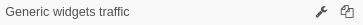

# Administración de Dashboards y Widgets

En la sección **Dashboards** el usuario puede crear una gran variedad de **widgets** que muestren información específica que capture la plataforma, ya sea para llevar a cabo una monitorización eficiente o por mera organización de estos componentes. La idea es que tanto usuario como organización puedan tener un mejor control del análisis de datos desde una única pantalla.

## Requerimientos

La mayoría de los widgets van a requerir de algún tipo de **sensor** o **herramienta** operativos para que sean funcionales. Sabremos cuál en base a que los widgets están categorizados por módulos. Implicitamente, para que un sensor se encuentre operativo, es necesario que el módulo correspondiente se encuentre habilitado.

!!! warning "En caso de que un administrador de la máquina deshabilite un módulo por consola..."
    La deshabilitación de un módulo causará un **error** si el usuario intenta acceder a un dashboard donde exista un widget de esa categoría. Por lo tanto, antes de deshabilitar dicho módulo, se recomienda exportar el dashboard y/o eliminarlo.

Además, para acceder a los widgets, hace falta tener permisos de edición sobre el dashboard que se pretende editar, ya que es el contenedor que albergará los widgets.

## Menú de Dashboards y Widgets

A parte de la lista de los dashboards disponibles, un administrador puede acceder a las siguientes acciones:

- **Añadir dashboard/Importar dashboard**: permiten añadir un nuevo dashboard personalizado e importar otros ya creados. El proceso de creación e importación del dashboard se verá más adelante.
- **Añadir Widget**: añada los widgets que desea personalizar en el dashboard.
- **Tiempo de actualización**: los datos en los dashboards se actualizan cada 300 segundos (5 minutos), este tiempo es personalizable desde *General Settings*. Verá una cuenta regresiva del tiempo restante hasta la próxima actualización. Puede restablecer la cuenta haciendo clic en la figura que se muestra. En ese momento, aparecerá la palabra "Detenido". Haga clic nuevamente para iniciar la cuenta regresiva.
- **Desbloquear**: El usuario tiene la opción de bloquear / desbloquear el dashboard que está consultando para que ningún otro usuario con permisos pueda editar el dashboard.

*Menú de acciones en dashboard*
## Crear y configurar un dashboard

Ya sea porque la organización ha restringido los permisos de los usuarios, porque la organización no tiene ningún dashboard o porque el usuario simplemente quiere gestionar su propio dashboard, el usuario va a llegar a la conclusión de crear uno nuevo. En el menú de dashboard se encuentra el botón **Añadir dashboard**.

El primer paso será crear un panel en blanco. Luego habrá que agregar los widgets que satisfagan las necesidades de visualización.

*Localizar añadir un dashboard*

Al pulsarlo se nos abrirá el formulario para editar las propiedades del dashboard:

*Editar un nuevo dashboard*

El dashboard puede ser reconfigurado pulsando el botón de edición (icono de llave inglesa) al lado del dashboard que se pretende editar.

*Localización de las acciones para el dashboard*

La aparencia es similar a la de editar un dashboard ya creado, a escepción de las acciones de **borrado**, **convertir en informe** y **exportar dashboard**.

*Editar un dashboard*

### Editar las propiedades del dashboard

Existen múltiples propiedades que se pueden rellenar:

- **Nombre**: Nombre del dashboard. Este nombre se mostrará en la lista de dashboards y es el único valor que es **obligatorio** rellenar.
- **Establecer este Dashboard como predeterminado**: Siempre hay un dashboard asignado por defecto. Es el dashboard que se muestra tras completar el proceso de **login**. Si se quiere cambiar, por este dashboard, tan sólo hay que marcar la casilla.
- **Descripción**: Descripción adicional para el dashboard, que se puede utilizar para listar los widgets que se pretenden incluir o justificaciones sobre las restricciones sobre sus usuarios.
- **Diseño**: La opción **basado en columnas** es la opción por defecto y restringirá la posición y las dimensiones de los widgets para ajustarse a una cuadrícula. En el caso de seleccionar la opción **posición fija**, no habrá restricción natural sobre dónde colocar los widgets sobre el dashboard.
- **Color de Fondo**: El dashboard puede ser personalizado con un color de fondo dentro de una paleta de colores. Tan sólo hay que pulsar la casilla que guste.
- **Usuarios dashboard**: Por defecto, sólo el usuario que creó el dashboard puede verlo y editarlo. Sin embargo, la lista **Usuarios dashboard** se puede ampliar para añadir usuarios adicionales que tengan permisos de edición sobre el dashboard.
- **Dominios dashboard**: Si se quiere dar acceso a un grupo de usuarios que compartan un dominio en común, es mejor añadirlo a la lista de **Dominios dashboard**. Así, todos los usuarios que tengan acceso al dominio también tendrán acceso al dashboard.

!!! note "En caso de introducir un nombre que ya exista..."
    El sistema permite la duplicidad de nombres de dashboard, pero se recomienda no hacerlo, ya que puede dar lugar a confusión.

!!! warning "Si actualiza algún parámetro"
    Recuerde pulsar **Actualizar Dashboard** para registrar los cambios o se perderán.

### Clonar un dashboard

El otro botón (icono de dos hojas) sirve para clonar el dashboard. Al pulsarlo, tan sólo pedirá que se le cambie el nombre al nuevo dashboard:

*Nombrar un clon de dashboard*

### Añadir un usuario al dashboard

Para añadir un usuario con permisos pulsamos el botón **Añadir** y seleccionamos los usuarios que queramos de la lista desplegada:

*Lista de usuarios*

Estos usuarios tendrán permisos para ver e interactuar con los widgets del propio dashboard. Si se les quiere añadir permisos de edición, hay que marcar la casilla **Editar permisos**.

### Añadir un dominio al dashboard

Alternativamente, los permisos pueden basarse en el nivel de acceso en términos de **dominio**. De tal manera que todos los usuarios que tengan acceso a ese **dominio** también tendrán acceso a ese **dashboard**.
Para añadir un dominio con permisos pulsamos el botón **Añadir** y seleccionamos los dominios que queramos del árbol desplegado:

*Dominio a añadir la lista*

Una vez seleccionados los dominios que desea añadir, debe pulsar el botón **Añadir Dominios** para confirmar la operación. Así, los nuevos dominios se añadirán a la lista:

*Dominios añadidos a la lista*

En cuanto a los permisos existen 3 opciones:

- **Ninguno (opción por defecto)**: Por defecto, sólo los usuarios incluidos en el dominio van a poder ver e interactuar con los widgets de este dashboard.
- **Solo por Admins**: Sólo aquellos usuarios que estén incluidos en el dominio y tengan nivel de administrador van a poder configurar el dashboard.
- **Todo**: Sólo los usuarios incluidos en el dominio van a poder configurar el dashboard.

### Borrar dashboard

Durante la edición, el botón borrar permite borrar el dashboard. Al pulsarlo, pedirá una confirmación.

*Confirmar borrado*

### Exportar e importar un dashboard

Al pulsar el botón **Exportar Dashboard** se abrirá el navegador de ficheros para que el usuario descarge el dashboard actual en formato *.csv*. Cuando que se quiera importar, se podrá hacer pulsando **Importar Dashboard** en el **menú de dashboards**. Es una herramienta muy útil para compartir dashboards o para guardarlos en un lugar seguro.

### Generar informe

Los dashboards también se pueden utilizar como plantillas. Luego esas plantillas se pueden utilizar para generar **informes** de manera automática. Para generar la plantilla hay que pulsar **Convertir a Informe** y se guardará en la sección **Informes**.

*Confirmar añadir informe*
## Creación de un widget

Para crear un widget, habrá que situarse en un dashboard y expandir sus opciones de edición.

*Creación de widgets: localización*

Esto nos mostrará las categorías presentes. Al hacer clic en una de ellas, podremos acceder a la lista de widgets para esa categoría.

*Creación de widgets: categorías*

Al hacer click a una de ellas podremos acceder a la lista de widgets para esa categoría.

Al hacer click sobre una de las opciones, se abrirá el formulario de creación del widget.

*Creación de widgets: configuración*

### Propiedades del widget

Durante la creación o edición de un widget, habrá varias propiedades que definir para ese widget. Dependiendo del widget, habrá que ajustar unas propiedades u otras. El conjunto de propiedades es:

- **Nombre**: Título del widget
- **Tipo de gráfico**: Tipo de visualización con la que se quiere mostrar los datos.

*Selección del tipo de gráfico*

- **Dashboard destino**: Dashboard que alojará el widget. Por defecto será el dashboard en el que nos encontremos actualmente.
- **Click action**: Los widgets son elementos que responden al hacer click sobre ellos. Aquí se define qué acción realizan: como dirigirse a la **vista** particular o ir a otro dashboard.
- **Rango**: Ventana de tiempo de la que mostrar datos.
- **Agregación**: Métrica que se utilizará para calcular los valores representados en la gráfica.
- **Tipo Serie**: Propiedad para decidir cómo se muestran las múltiples lineas de un mismo gráfico.
- **Granularidad**: La distancia en tiempo entre dos muestras de la gráfica. Una baja granularidad significa una mayor definición en el gráfico.
- **Análisis**: Detalles estadísticos que se pueden añadir a la gráfica sobre los valores a medir.
- **Zona horaria**: Para definir el contexto del widget un función de su geolocalización (si es que ese widget representa alguna).
- **Color**: El primer color de línea que se usará para el gráfico.
<!-- Referencia -->
- **Filtros**: Al igual que en las **vistas** los widgets también se pueden filtrar para mostrar exactamente los datos de interés.
- **Número de elementos**: Número máximo de elementos a mostrar en el gráfico.
- **Columns**: Listado de campos que se quieren añadir al gráfico. Al hacer click sobre la caja se desplegará la lista.

*Columnas*

- **Siempre mostrar texto**: Si se quiere que se muestre el texto del widget, independientemente de si el ratón se encuentra sobre el widget o no.
- **Invertir colores**: Si el valor a representar está codificado como un color, se puede invertir el mapa de colores en función de ese valor.

*Balls graph with threshold of 1*

- **Tamaño de fuente**: Altera el tamaño del texto en el widget.
- **Alineamiento**: Posiciona el texto dentro del widget.
- **Imagen**: Referencia de la imagen que desea mostrar en el widget. Úselo para cargar una imagen desde su disco local.
- **Mantener la relación de aspecto**: Si se quiere que la imagen no se deforme como consecuencia del dimensionamiento del widget.
- **URL**: Link the la página que se quiere cargar dentro del widget.
<!-- - **Altura del widget (pixeles)** -->
- **Único**: con esta opción, las ocurrencias o eventos de una columna se aíslan en un momento específico.
- **Agrupados**: con esta opción, las ocurrencias o eventos de una columna se aíslan a un tiempo específico agrupado de acuerdo con los criterios determinados.

El usuario puede modificar la información asociada con cada uno de los dashboard disponibles seleccionando "Configuración general", haciendo clic en el icono de la herramienta.

## Acciones sobre el widget

El usuario puede acceder a las acciones de cada widget en el dashboard desplegando el menú de la esquina derecha del widget, señalizado por el icono de **tres puntos verticales**. Las siguientes acciones están disponibles:

- **Clonar**: Permite duplicar el widget e incorporarlo directamente en el dashboard que el usuario seleccione.
- **Editar**: Permite modificar las propiedades y configuración del widget.
- **Exportar a PNG**: Permite descargar la información mostrada actualemnte en el widget en formato PNG.
- **Recargar**: Recarga los datos del widget para mostrar la información más reciente.
- **Borrar**: Borra el widget del dashboard actual.
- **Expandir**: Muestra el widget en pantalla completa para una mejor visualización.
- **Exportar datos**: Permite descargar los datos del widget en formato CSV o JSON.

*Acciones sobre el widget*

A parte, el widget es un elemento arrastrable, por lo que se puede desplazar a cualquier lugar dentro del dashboard. Para ello se debe hacer click sobre el título del widget y arrastrarlo. Una sombra mostrará el lugar donde se posicionará el widget cuando se suelte el botón.

*Reposicionar el widget*

Por último, el usuario también puede escalar el widget dentro del dashboard, arrastrando la esquina inferior derecha del widget.

*Redimensionado del widget*

!!!warning "Si hay un click action configurado..."
    Recuerde que si el widget tiene un click action configurado, al hacer click sobre el widget se ejecutará redireccionará a la vista o dashboard que se haya configurado.

## ¿Qué hacer a continuación?

Ya sea como administrador o como usuario, configure los dashboards que considere necesarios para su organización y para sus usuarios.
