# Tools and Administration

In the menu bar settings area, near *Sensors*, we can find the *Tools* section where we can find options to configure the platform.

Tools: available options to configure the platform

In this dropdown menu, you can find access to the configurations that define, for example, the conditions that must be met for the user to be notified by an alarm, track user activities on the platform, register new users, or manage the configuration of the cluster, sensors, and servers, among many other actions.

Expand the following tabs to read a description of the options found in the tools menu.

??? note "Alarms"

    ## Alarms

    An alarm is a notification that is triggered when one or more conditions are met.

    When accessing this option, the list of registered alarms is displayed.

    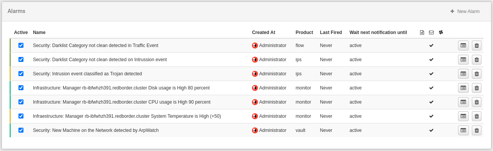

    List of active alarms

    ### Create a new alarm

    By clicking on the **New Alarm** button, we access the form, where the conditions that the alarm must meet to trigger a notification, and the severity level defined for that alarm, are established.

    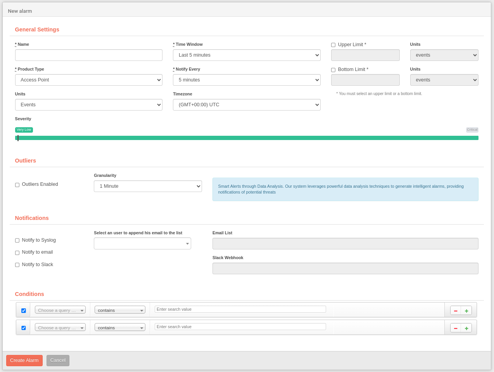

    Create a new alarm

    1. **General Settings**

        | Field              | Description                            |
        | ------------------ | -------------------------------------- |
        | Name               | Name of the alarm |
        | Time window        | Time interval that must be exceeded by excess or predetermined values given in the upper/lower limit for the alarm to be active |
        | Product type       | Select the type of application/element for which the alarm has been defined. The user will see the options included in their license in this field |
        | Notify every       | Sets the time sequence for notification |
        | Upper/lower limit  | Indicates the number of events (maximum/minimum) that must meet the alarm conditions to trigger the notification |
        | Unit               | Desired aggregation for the alarm. It will vary depending on the aggregations available in the desired product type |
        | Time zone          | Allows choosing the time definition to be used for the alarm |
        | Severity           | The user must define the severity level given to the alarm. Depending on the conditions defined for the alarm, it will imply a very low, low, medium, high, very high, or critical risk. This severity grading is also indicated on a color scale |

    - **Outliers**

        RedBorder uses data analysis techniques to provide notifications of potential dangers, this option allows the user to configure smart alarms that will be triggered if any network anomalies are detected within the filters specified in the *Conditions* section.

        Activating this option will perform an anomaly analysis once the configured **Time window** in the alarm's *General Settings* has passed.

        The **granularity** indicates the level of temporal detail that the alarm will use to analyze the data.

    - **Notifications**

        | Notification method       | Description                            |
        | ------------------------- | -------------------------------------- |
        | Syslog                    | Allows exporting notifications to an external syslog server |
        | Email                     | Enables the selection of users to send notifications via email when an alarm is triggered |
        | Slack                     | Enables the *Slack Webhook* field that allows the platform to send a message to a Slack channel when an alarm is triggered |

    - **Conditions**

        These are the filters that will trigger the alarm. They can be configured similarly to how they would be configured in the type of application/element for which the alarm has been defined.

??? note "Audits"

    ## Audits

    This option shows a list of user activity (or users) recorded on the Redborder platform, ordered chronologically by default. The user can sort the table in ascending or descending order for each of the columns. The search box at the top can be used to filter the information you want to see. The columns shown in this table are as follows:

    - **User**: user who performed the action
    - **Resource**: element that has been created, modified, or deleted
    - **Action**: action that has been carried out (creation, editing, deletion)
    - **Message**: brief description of what has been audited
    - **Timestamp**: date and time of the activity record

    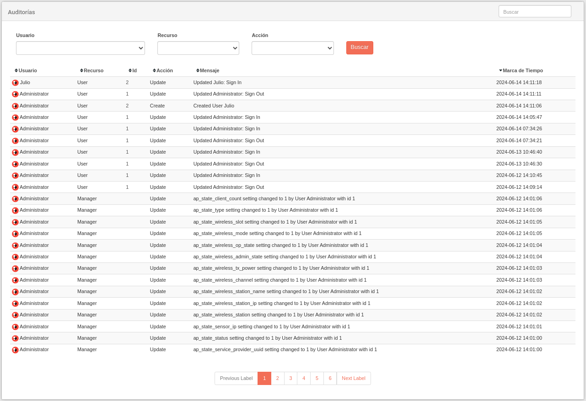

    Audits: user activity log

??? note "Cluster Settings"

    ## Cluster Settings

    The Cluster Settings option allows us to check the status and configuration of the cluster, and establish the cluster creation process during the Manager installation process.

    You can modify these values by editing through the Unlock button. The information can be changed with the following parameters:

    - Cluster status
    - Historical Nodes
    - Historical Rules

    

    Cluster Configuration: Cluster status and configuration

??? note "Correlation Engine Rules"

    ## Correlation Engine Rules

    Here the user can see all the rules for the correlation engine. It is possible to edit existing rules and also create new ones.

    

??? note "Mitre ATT&CK"

    ## Mitre matrix

    The Mitre matrix is a threat intelligence framework that allows us to identify the different types of attacks that can be carried out against a system. This information can be imported into the platform to be used to complement other sections of the platform, like **Incidents** or **Dashboards**.

    By default, the Mitre matrix needs to be downloaded from the official website. 

    
    
    *No Mitre downloaded*

    ### Mitre Tactics overview

    Just press the download button and come back in a minute. After that, you can see the **Mitre Tactics** list.

    

    *Mitre Tactics*

    The default list will show all the tactics that the MITRE framework has defined with the number of IPS rules associated with each one.

    ### Mitre Matrix view

    The Mitre matrix is a table that shows the different techniques that have been triggered by any intrusion event during a certain period of time. Like other modules, the time frame can be edited to filter the information you are looking for, as well as other unique fields like **tactics** and **techniques**.

    

    *Mitre Matrix*

    The cells of the matrix are colored according to the highest of the severities defined on the triggered rules, which indicates the level of impact that the attack can have on the system. On the other hand, the number indicates the number of rules that have been triggered by the attack.

    It is useful to have a global view of the attacks that have been carried out against the system, especially when different techniques are used to carry out the attack because it can mean that the attack may have a high impact on the system. It is also useful to prioritize the actions to be taken to mitigate the attack, or simply cover the vulnerabilities that can be exploited.

??? note "Monitor Categories"

    ## Monitor Categories

    Here we can add a new category to monitor hardware. The categories use technologies like *SNMP*, *Redfish*, *IPMI*, or a *Bulkstats* scheme to provide information about the system and its operation.

    

    Monitor Categories

    To add a new monitor category, we need to use the button in the upper right corner. Then we will fill in the fields by selecting the correct technology that allows Redborder to receive the data.

    

    Infrastructure Monitor

    ### SNMP Operations

    To explain the operation of the *SNMP* function, we will use an example, monitoring memory usage. When we create a new monitor category with the **New monitor category** button on the **Monitor Categories** page, we will see the following popup window.

    

    Initial creation of a monitor category

    This is the formula to calculate the memory usage of a device:

        100*(memory_total-memory_free-memory_total_buffer-memory_total_cache)/memory_total

    The result is a combination of different *SNMP* values. Now, if we want to create a monitor like this example, we must choose *SNMP Operation* in the technology dropdown menu.

    Below the *OID* field, there is now a button called Add new variable, which adds another field so we can enter more *SNMP* OIDs. The OIDs used are:

        UCD-SNMP-MIB::memTotalReal.0
        UCD-SNMP-MIB::memAvailReal.0
        UCD-SNMP-MIB::memBuffer.0
        UCD-SNMP-MIB::memCached.0

    At the bottom, there is an *OID* Operation field, where we will enter the operation we want to perform with the previously entered *OIDs*.

    

    Example Monitor

    For each *OID*, the output will be stored in a variable that we will then use in the OID operation.

    At this point, we just have to create the monitor by pressing the *Create* button.

    To add the new monitor to a sensor device, we will create a new sensor on the Sensor tab, selecting *Monitor Device*.

    ### Bulkstats

    *Bulkstats* (Bulk Statistics) are statistics that are collected in a group or scheme, such as system statistics, port statistics, or *Radius* statistics.

    It is possible to view *Bulkstats* information in the Redborder manager; for this, it is necessary to configure the client part on the Cisco device to activate the information sending to the manager via *FTP*.

    Once this is done, we will be able to view all the *Bulkstats* information in the Redborder manager by accessing its corresponding tab and selecting the desired fields within the Monitor module.

    

    Monitor Module: Bulkstats Fields

    To define a custom *Bulkstats* monitor, it is first necessary for the user to have a *Bulkstat* schema on their network device that can be saved in a plain text file and named (e.g., *Bulkstats-Schema.txt*).

    Normally, *bulkstats* schemas look like this:

    

    Bulkstats Schemas: Plain Text File

    Then, click on the **New monitor category** button and within the new monitor category form, select *Bulkstats* from the **Technology** list. This will show the new option to place your bulk file schema file that defines the user's configuration.

    

    New Monitor Category: Technology Selection

    To assign the new monitor category to a *device sensor*, it is necessary to create a *monitor device* (if the user has not already created one) from the *Sensor Tree* view.

    Click on the sensor menu and then click on *Monitors*.

    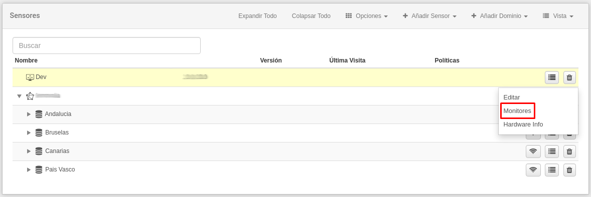

    Sensor Tree

    Within the monitor menu, press the **Add Monitor** button and within the window, press the **Add** button corresponding to the created monitor category.

    

    Device Monitors: Add Monitors Mode Shown

    Once the monitor is added to the sensor, it will show the destination where you need to configure the device to send the information.

    

    Device Monitors: Destination Path

    The *URL* corresponds to the destination path. It is necessary to configure the *SFTP* protocol on the device's network to send information about the *bulkstats* schemas to the manager.

??? note "Licenses"

    ## Licenses

    Through this option, the user can check which nodes have expired licenses. Likewise, it is possible to upload a new license or request a new one.

    At the top edge of the screen, the number of available licenses, the applications that can be used with these licenses, and the number of expired nodes are indicated. There is a list of expired nodes that need to renew their licenses in the center of the screen. There is also a list of available actions.

    To upload a file with a new Redborder license, click on **Upload License**. To request a new license, click on **Request license**.

    

    Licenses: Check and update expired licenses

??? note "Lookup Sources"

    ## Lookup Sources

    List of web service URLs that perform network data queries. From this screen, it is possible to add more web services as well as edit existing ones.

    - **Delete a service**: click the "Delete" button.
    - **Edit an existing service**: click the "Edit" button:

        

        Lookup Sources: Web Service Queries

    - **Add a new web service**: click the **Add Lookup Source** button.

        

        Add a new Lookup source

??? note "Objects"

    ## Objects

    This option allows the direct creation and editing of objects related to internal applications, end users, protocols, etc. The user can navigate through different tabs corresponding to the categories of objects that can be created. If you want to locate objects more efficiently, you can use the browser.

    Three object categories can be created:

    - Network
    - MAC
    - VLAN
    - Service
    - APP

    

    Objects: object list

    - **Create a new object**: click on **New Net Object** (Network, MAC, VLAN, Services, App)
    - **Edit an existing object**: click the **Edit** button.
    - **Delete an object**: click the **Delete** icon.

    

    Objects: create a new object

    In all cases, when creating or editing an object, the system asks for a name, a value, and a description.

    Additionally, if the object is of the network or MAC type, it will ask us for the operating system, IP address(es), as well as the possibility of creating the object for the current user, or making it public.

    In the upper right margin, there is a submenu of options. It allows the user to import or export data related to these objects in .csv format.

    !!! info "Note..."
        It is possible to create an object directly from the attributes shown in the data tables of the modules. To do this, go to the module and click on the inverted triangle that appears when hovering over an attribute such as IP, MAC, or VLAN.

??? note "Object Types (WIP)"

    ## Object Types

    This option allows the user to create categories for network objects, thereby creating an inventory of the objects found on the network.

??? note "Overlay Maps"

    ## Overlay Maps

    This option allows overlaying an image on a Google map for more customization.

    - **Edit map**: click the *Edit* button next to the existing map list.
    - **Add new map**: click on *New overlay map*.

    In both cases, you will specify the map name, latitude, and longitude where the image should be located.

    Finally, upload the image from your computer in .jpg or .png format.

    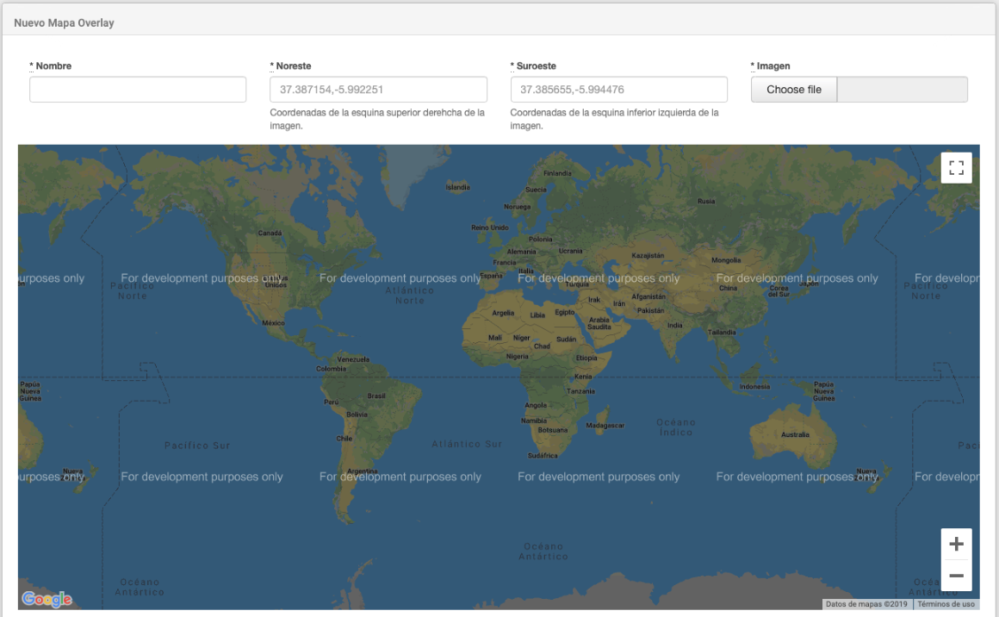

    Overlay Maps: overlay images on a world map

??? note "Platform Alerts"

    ## Platform Alerts

    Alerts are messages displayed to all users when they enter the web platform. This section is where platform alerts can be managed.

    There are three levels for alerts: information, warning, and danger. Each level has its own color so that the alerts can be differentiated, and all are placed below the menu bar. In the following image, we have an example of a test alert.

    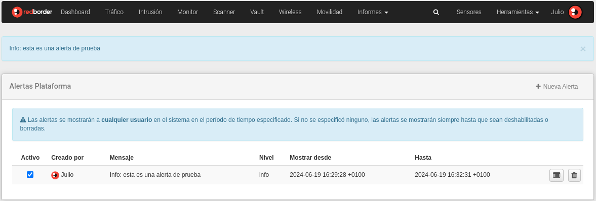

    Platform Alerts

    It is possible to create alerts for the platform using the New alert button. It is necessary to select the alert level and the alert message.

    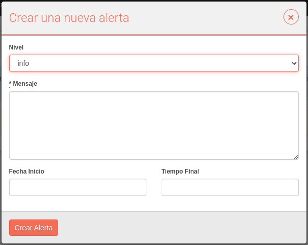

    Platform Alert: New alert

    If the user clicks on the alert message, it will not be displayed again until the user logs in again.

    It is possible to delete the alert by clicking on the cross in the message. After that, the alert message will no longer be displayed.

??? note "Rule Versions"

    ## Rule Versions

    The user can manage the platform's rule sources. It is possible to add or load new sources and also enable the selected ones. The rules are used for the **Snort** probe, which is used by the intrusion module.

    

    Rule Versions

    It is possible to load rules for a particular IPS using the **Upload Source** option, where the user can select the file to upload.

    It is also possible to add sources to download new rules from the Internet that are updated periodically; if necessary, the user can force the update of the rules to ensure that all rules are up to date.

??? note "Support Center"

    ## Support Center

    Users can use the Support Center to resolve any questions or issues related to the platform. Registration in the Support Center is required.

    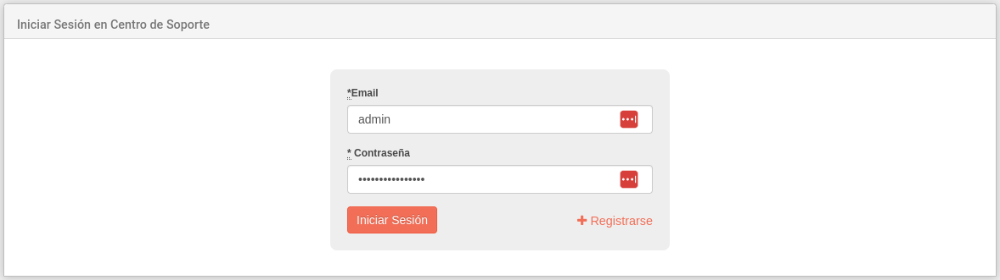

    Support Center

??? note "Users"

    ## Users

    Activation or modification of user data, service management, or creating new records is possible from the **User Configuration** interface.

    To search for a specific user, enter their details in the search bar. You can also browse through the alphabetical list located at the top of the user list.

    Users can only view sections of the platform (read-only mode) and cannot modify content (except for their own user profile). The only user with permissions to do this is the Superadministrator.

    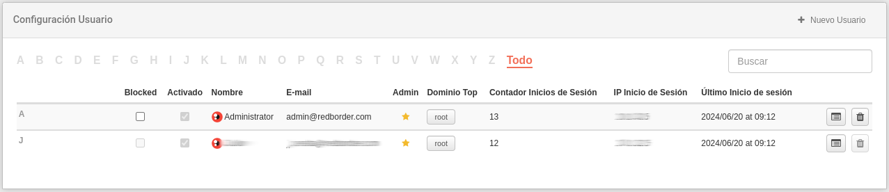

    Users: user permissions management interface

    The main screen shows a list of active users on the Redborder platform, email addresses, *Top Domain* (the highest level the user has access to), the number of logins, IP, and the time of their last access.

    By clicking the **Edit** button, the user can modify information and view a summary of their status and activity within the platform.

    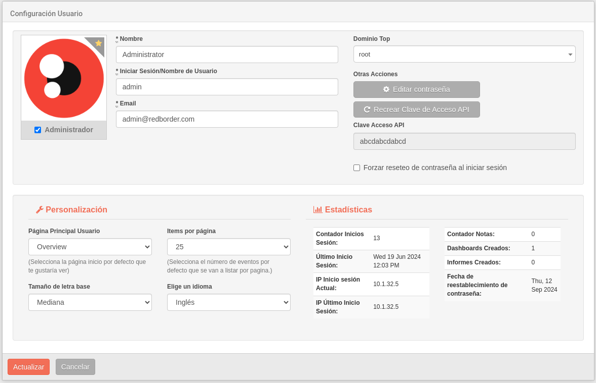

    Users: user profile editing

    !!! warning "Important"
        Each time any data in a user profile is modified, the current password must be entered to confirm the changes.

    To create a new user, click on **New user** and complete the required information in the user profile. You can check the **Administrator** box to grant the new user full permissions.

    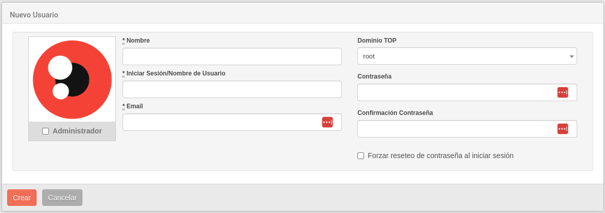

    Users: New user

    ### User Area

    In the upper right corner of the menu bar, you will find the user area, from which you can view notifications, check your profile, access contextual help, and log out of the system.

    

    User Area

    #### Notifications

    To view a summary list of notifications, click on the **user area**. To access a full list, select the **See all** option or click on any of the notifications in the summary; this will open a new screen where you can view notification details and delete all notifications using the **Clear all** option.

    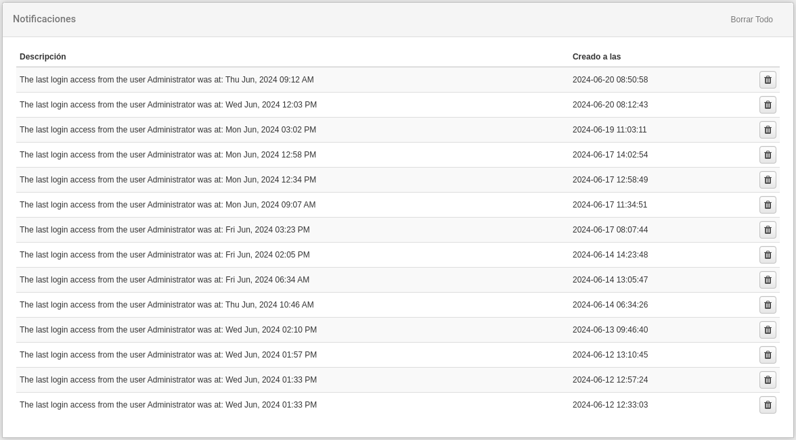

    User Area: notifications

    #### My Profile

    This option allows direct access to the user profile and performs the same actions as the **Tools -> Users** option.

    #### Show Help

    This option provides context-sensitive help to facilitate navigation and usability of the platform.

    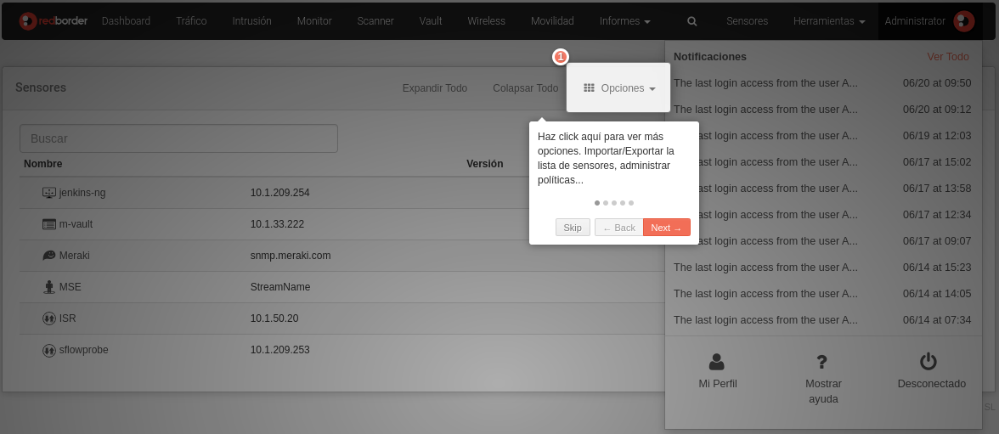

    User Area: help

    #### Log Out

    For secure disconnection from the platform, select the **Log out** option. The system will return to the login screen.

??? note "Worker and Job Queue"

    ## Worker and Job Queue

    In this option, users can check the status of the workers and the jobs running in the background. They can also verify which jobs have been completed.

    !!! info "Note..."
        **Workers** are programs that constantly run in the background.

        A **Job** is a program that runs periodically or only once but does not remain running in the background. It runs and then closes.

    

    Worker and Job Queue: status of the worker list and job queue.

    Jobs can be launched manually by the menu **Worker Options**

    

    Worker and Job Queue: Jobs possible to launch manually.

    !!! info "Note..."
        There are jobs that need to be deleted before launch them manually.
    
    ### Jobs

    #### Delete Stored Job

    When this job is running, it deletes all stored jobs since a date. That date depends on the number of days to keep the stored jobs information.

    !!! info "Note..."
        There is a field in **General Settings** to change the default value of **90** days of stored jobs to keep.

        When this value is **0**, It deletes all stored jobs **older than yesterday 23:55 h**.

        This job is scheduled to run **everyday at 00:00 h**.
    
    

    Worker and Job Queue: Field of days to keep Stored Jobs.

    ## Stored Jobs
    
    **Stored Jobs** shows the list of completed services. Also, you can search by the **name of the job**.

    

    Worker and Job Queue: list of jobs stored.

    ### Information

    Allow to check status and other information of the job.

    

    Worker and Job Queue: Information message message example in stored jobs.

    ### Delete

    Delete from Stored Jobs the selected job.

    

    Worker and Job Queue: Delete message example in stored jobs.

    ### Search

    You can search by the name of the job and it refreshes automatically each time a letter changes.

    

    Worker and Job Queue: Example searching by "r".

    

    Worker and Job Queue: Example searching by "rb".

    

    Worker and Job Queue: Example searching by "x" to get a **no result search**.