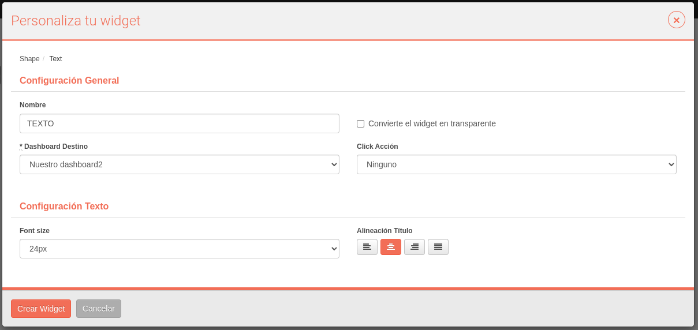

# Widgets

En la sección ***Dashboards*** el usuario puede crear una gran variedad de **widgets** que muestren información específica que capture la plataforma, ya sea para llevar a cabo una monitorización eficiente o por mera organización de estos componentes.
es.

## Requerimientos

La mayoría de los widgets van a requerir de algún tipo de sensor operativo para que sean funcionales. Sabremos cuál en base a que los widgets están categorizados por módulos. Implicitamente, para que un sensor se encuentre operativo, es necesario que el módulo correspondiente se encuentre habilitado.

!!! warning "En caso de que se deshabilite un módulo..."
    La deshabilitación de un módulo causará un error si el usuario intenta acceder a un dashboard donde exista un widget de esa categoría. Por lo tanto, antes de deshabilitar dicho módulo, se recomienda exportar el dashboard y/o eliminarlo.

Además, para acceder a los widgets, hace falta tener acceder a un dashboard.

## Categorías disponibles

    - *Tráfico*: 
    - *Intrusión*:
    - *Mobilidad*:
    - *Escáner*:
    - *Vault*:
    - *Wireless*:
    - *Infrastructure*:
    - *Shapes*:
    - *Combination*:

Podremos seleccionar una de estas categorías cada vez que creemos un widget.

## Creación de un widget

Para crear un widget, habrá situarse en un dashboard y expandir sus opciones de edición.

Esto nos mostrará las categorías presentes.

Al hacer click a una de ellas podremos acceder a la lista de widgets para esa categoría.

A continuación se describe la variedad de widgets que existe en cada categoría

### Formas

Esta categoría actúa como miscelánea, porque lo que permite configurar no está asociado a ningún modelo. A parte, la información que van aportar estos widgets son organizativos y no llevan una monitorización particular.

#### Texto

Este widget actúa como cuadro de texto. Sirve para relatar partes concretas del dashboard. Al acceder a su configuración, podemos modificar el texto a representar, el tamaño y su alineación dentro del widget.

#### Imagen
#### Cuadrado
#### URL Personalizada

