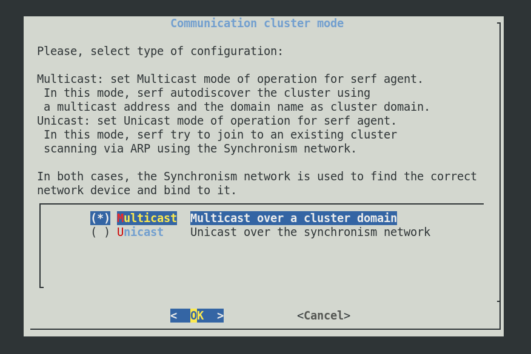
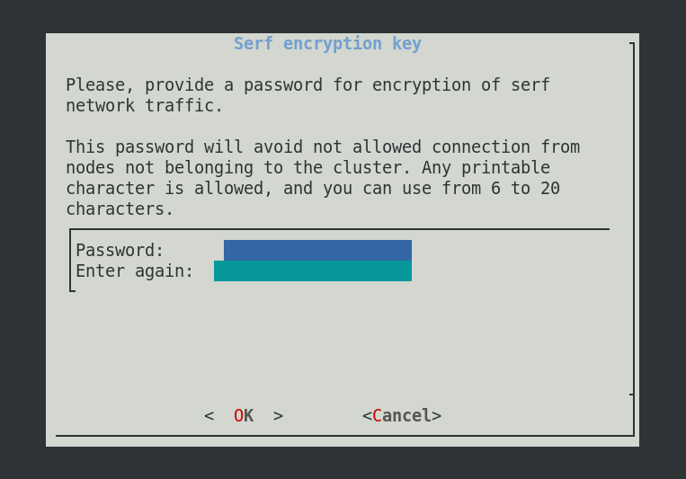

# RedBorder Manager Installation

Welcome to the RedBorder installation process. Thanks to this guide, anyone can prepare the platform **without specific programming knowledge in Linux**.

Installing the RedBorder Manager is the first step to start monitoring and protecting your network information with RedBorder's solution. You should review the content of this chapter before starting the installation of the platform (also known as the RedBorder Manager).

!!! tip "Recommendation..."
    Have a minimal knowledge of networking, as well as basic networking concepts.

## Installation Requirements

!!! info "Please note..."
    If you run the platform in a virtual environment, **performance may decrease** compared to an implementation on a physical machine.

The successful implementation of RedBorder requires at least one machine with the Rocky Linux 9 operating system installed. The hardware requirements will depend on whether we install a single manager or a cluster. For each case, these requirements are:

=== "Manager"

    * Disk: 80 GB
    * RAM: 16 GB
    * CPU: 4 cores
    * Network Interface: At least one

=== "Cluster"
    * Three machines with following specifications each:
        * Disk: 80 GB
        * RAM: 16 GB
        * CPU: 4 cores
        * Network Interface: At least two

## Installation Process

The first action to start monitoring your network with RedBorder is to obtain the latest official RedBorder packages for **Rocky Linux 9** available at [repo.redborder.com](https://repo.redborder.com).

!!! info "In the case of installing a cluster..."
The entire installation process specified on this page must be repeated for each manager that will make up the cluster.

``` bash title="Config of required repositories"
dnf install epel-release && rpm -ivh https://repo.redborder.com/ng/latest/rhel/9/x86_64/redborder-repo-latest-1.0.0-1.el9.rb.noarch.rpm
```

``` bash title="Redborder Manager Package Installation Command"
dnf install redborder-manager
```

With the packages downloaded and installed, the next step is to configure RedBorder. To do this, we restart the console session:

``` bash title="Console relogin command"
/bin/bash --login
```

This will update the script paths, allowing us to run the **installation wizard**:

``` bash title="Installation wizard command"
    rb_setup_wizard
```

This will start the **installation wizard** for the platform in the console, which will serve as a guide throughout the entire process.

### Network Configuration

In the lower box, the existing network interfaces on the machine in question are listed. Underneath all the interfaces that the machine possesses, there is the `Finalize` option, which we can select **after successfully configuring the interfaces**.


Network Configuration

By selecting an interface and entering it, we are given the option to configure it with a static IP address or to function dynamically (with DHCP).


Network Interface Configuration

If selecting the static IP option, you must specify the IP address, subnet mask, and default gateway:


Static Interface Configuration

### DNS Configuration

The installation wizard will give you the option to choose whether or not to configure DNS servers. If you wish to configure DNS.

Configuring at least one server is mandatory; however, it is currently possible to configure up to 3 DNS servers in the platform. This can be done on the following screen:


DNS Configuration

### Hostname and Domain

During installation, you have the option to decide the hostname for the RedBorder node, as well as the domain used for communication with potential RedBorder Proxy servers or RedBorder IPS.

The hostname to choose must comply with the **RFC1123** standard.

!!! info "Please note..."
    The installation wizard automatically generates a random hostname for the machine, as well as indicates a default domain name, which is recommended not to change unless necessary.


Hostname and Domain Configuration

### Clustering Service Configuration (Serf)

RedBorder has the ability to work in a distributed manner, distributing functions or workload among two or more nodes, through a synchronization network that allows nodes to communicate and operate. For this, we use **Serf**(1), this service is responsible for creating the manager cluster and defining the roles of the nodes.
{ .annotate }

1. Serf is a decentralized solution for service discovery and orchestration that is lightweight, highly available, and fault-tolerant.

For Serf to work correctly, three parameters are required:

- Sync network


- Indicate the Serf mode (Unicast / Multicast)



- Secret key to encrypt Serf network traffic



### Storage with Amazon S3 (WIP)

When performing a remote installation of RedBorder on AWS, it is also possible to use Amazon's remote storage service with S3.

### External Database (WIP)

It is also possible to configure RedBorder to use the Amazon RDS service or some other PostgreSQL database.

### Selecting Manager Mode

Depending on the RedBorder installation you want to perform, you can indicate to the platform what should be executed on the node being installed. The most common case will be the installation of a single manager in the network, for this, you must choose the `full` mode, indicating to the platform that it should run all services on the machine in question.

!!! tip "Please note..."
    If a manager cluster will be installed, one of the nodes must operate in core mode while the other nodes must operate in `custom` mode and select which services they will maintain.


Manager Mode Selection
