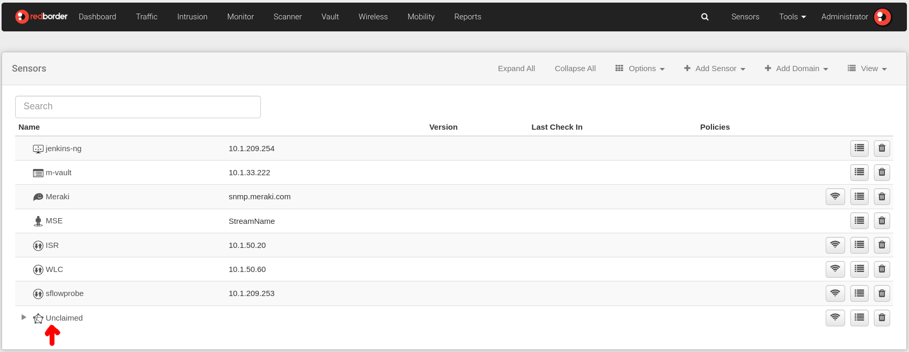
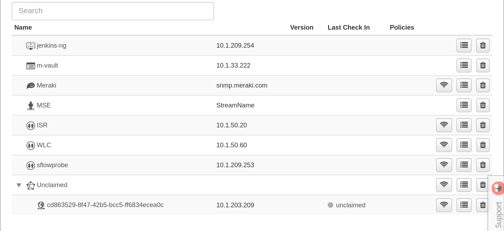
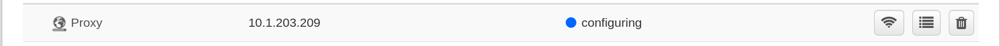
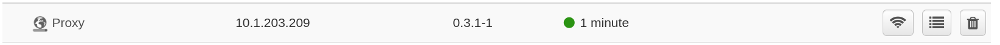

# Proxy Sensor

## INTRO

A Proxy sensor will represent the device that exports the configured type of information from an external location to the manager's own location.

## Identifying the Proxy Sensor

The sensor must be claimed in the manager to start retransmitting data from the proxy. To do this, go to the Sensors section on the website. In the list of sensors, you should see a section called Unclaimed.



Unclaimed Sensors

This menu can be expanded by clicking on it, and you will see the sensors pending to be claimed by the manager.



Proxy Unclaimed

The **globe** icon indicates that it has been identified as a proxy. If you have just completed the installation process, you can be certain that the IP displayed on the website is the same as the management interface.

!!! info "Keep in mind..."
    The IP shown on the proxy sensor corresponds to the management interface.

## Claiming the Proxy Sensor

The proxy is identified with a unique hexadecimal character identifier. This serves as a link to claim the sensor. Let's select the identifier:


Selecting the UUID

Copy it by pressing CTRL + C, then click Add Sensor and Claim Sensor:


Claiming a sensor

This will show the following window:


Claim properties

In the name field, enter any name and in the UUID field, paste the identifier you copied earlier. Once the fields are filled in, click **Save**. This will queue the Proxy configuration. The website will show it with an indicator in its properties.



Configuration and claiming

## Proxy Sensor Autoconfiguration

If you have access to a console on the machine itself, you can observe the installation process with the journal:

``` bash title="Print the setup logs"
journalctl -u rb-register -f
```


Registration logs

At the end of the registration process, the sensor indicator will update its status to **configured** if successful; **failed** otherwise:



Proxy configured
