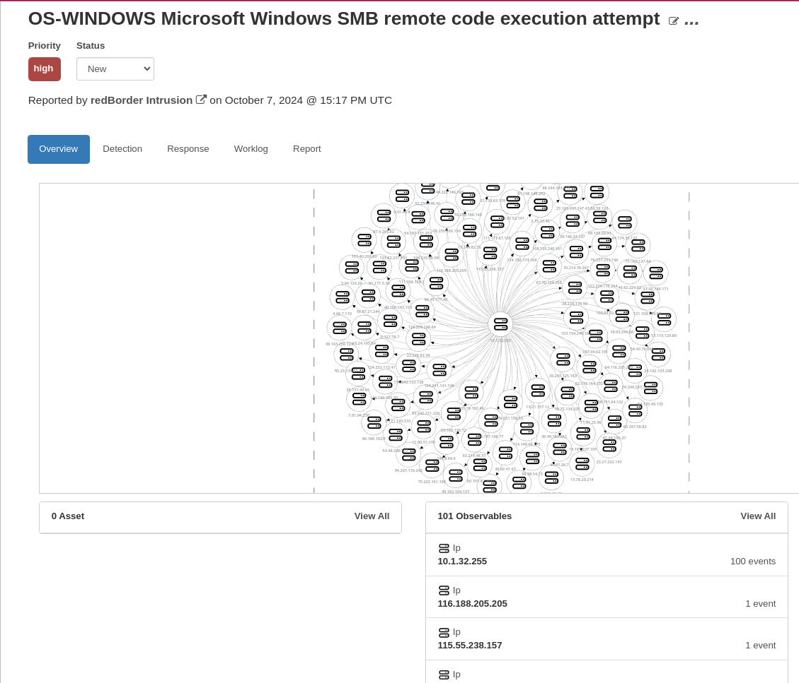
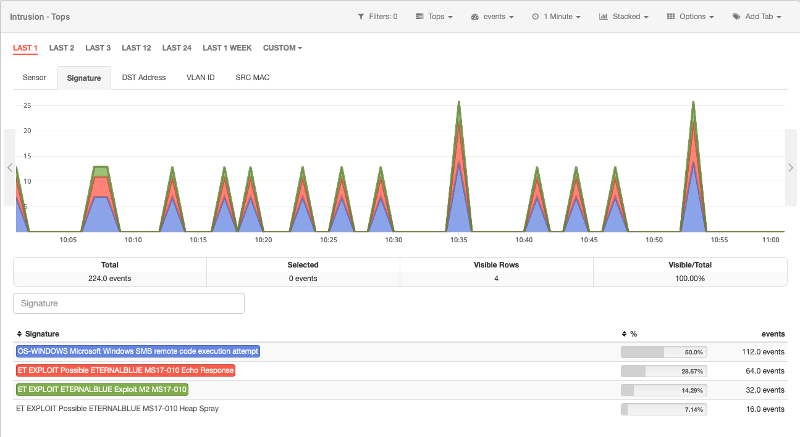

# Detecting an Eternalblue Attack with Redborder

In this case, we will see how to manage an *Eternalblue* attack incident. 

!!! info "Please note..."
    This case is based on a real incident, but captures taken corresponds entirely to a simulation.

## Context

It all starts with a malicious phishing email which contains a *dropper* that installs *ransomware*.

The *ransomware* will try to use a known *exploit* to take control of all possible machines.

Eternalblue attack: scenario

## Incident Management

On incidents view, a new incident has appeared that needs to be investigated. In this case, you are the one in charge of it.

*Incident List*

Clicking on the incident will show the details of the incident. Starting from the overview, you can see the incident is affecting to SOME machines.

*Incident Overview*

From here, you can deduce that the attack is important because it can be affecting to a lot of machines.

## Start the investigation

You can decide to start the investigation by keeping the incident open. However, in other situations, you can decide to reject the incident because it is a false positive or move the task to another person as reporting the incident. Whatever you do, add the corresponding note in the playbook, in the **Response** section.

*Incident response*

*First notes*

Notes can be expanded based on the information you have, as extra modules, access to the physical machine or external sources. But the most interesting place to look at is the corresponding source, which in this case is **Redborder Intrusion**. By clicking on it, it will redirect you to the corresponding view.

## Getting into the source

Redborder can use Snort rules to detect the *SMBv1* protocol echo response used by the *ransomware*, so we can use the intrusion module to see the signatures to identify the attack.

Eternalblue attack: Intrusion

Here we can see the current signatures collected by Redborder.

Eternalblue attack: filtering signature

Once we have filtered the *Eternalblue* signature, we can show the SRC Address metric to track IPs involved in the attack.

Eternalblue attack: selecting SRC Address metric

Now we have the IPs of the machines involved, so it is possible to take actions to solve the security hole.

Eternalblue attack: IPs involved in the attack

!!! info "Keep in mind..."
  
    It is important to have an updated version of Snort rules to detect weird behaviour and traffic with Redborder.

## Back to report

Going back to the incident response view, you should add the notes about the investigation. In this case, you can report the Source IPs discovered.

*Adding affected hosts notes*

And report that the next user need to review those hosts to start the next phase of the incident.

*Confirm incident notes*

## What's next?

It is expected that the reported user is picking up the incident on this state and start the containment phase fo the malware, starting with the affected hosts.
